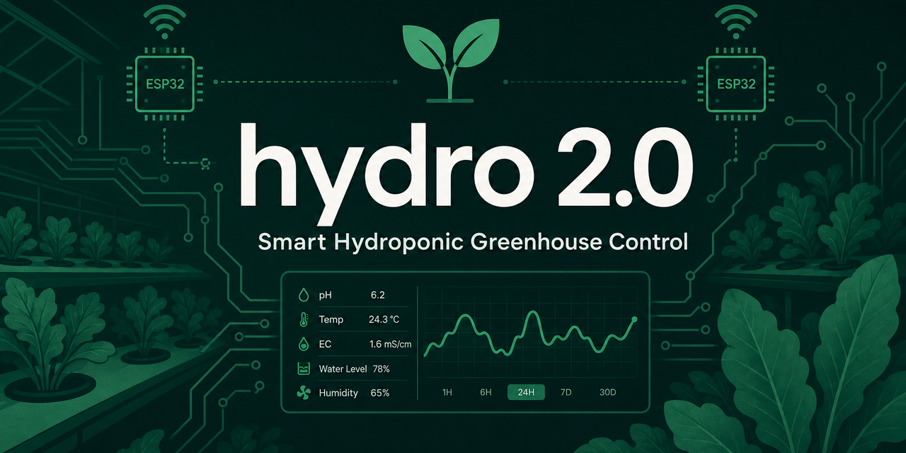

<p align="center">
  
</p>

<p align="center">
  <strong>Система управления гидропонной теплицей</strong><br/>
  от ESP32-нод до дашборда оператора — один монорепозиторий
</p>

<p align="center">
  <a href="https://github.com/byYorick/hydro2.0/actions/workflows/ci.yml"></a>
  <a href="https://github.com/byYorick/hydro2.0/actions/workflows/protocol-check.yml"></a>
  
  
  
  
  
  
</p>

---

## Зачем это

**hydro 2.0** — полный стек для автоматизации гидропоники:

- измерение и коррекция **pH / EC**, климат, полив, освещение
- иерархия **Теплица → Зоны → Узлы → Каналы**
- fail-closed автоматизация (**AE3**), E-STOP и irrigation failsafe
- realtime UI (Laravel Reverb) и Android-приложение

```text
ESP32  ←MQTT→  history-logger  ←REST→  automation-engine (AE3)
                      ↑                        ↑
                 PostgreSQL + TimescaleDB   Laravel API / Vue
```

Поток команд (инвариант):

`Laravel scheduler-dispatch → automation-engine → history-logger → MQTT → ESP32`

---

## Стек

| Слой | Технологии |
|------|------------|
| **Firmware** | ESP32 · ESP-IDF 5.x · NodeConfig · HMAC команд |
| **Transport** | MQTT (Mosquitto) · QoS1 · hierarchical topics |
| **Backend** | Laravel 12 · Inertia · Sanctum · Reverb |
| **Services** | Python: mqtt-bridge · history-logger · AE3-lite |
| **Data** | PostgreSQL + TimescaleDB |
| **Frontend** | Vue 3 · TypeScript · Pinia · Tailwind · ECharts |
| **Mobile** | Android |
| **Ops** | Docker Compose · Prometheus · Grafana |

---

## Быстрый старт

```bash
make up          # поднять dev-стек
make migrate     # миграции
make seed        # тестовые данные (опционально)
make logs-core   # laravel + AE + HL + mqtt-bridge
```

| Сервис | URL |
|--------|-----|
| Laravel / UI | http://localhost:8080 |
| mqtt-bridge | http://localhost:9000 |
| history-logger | http://localhost:9300 |
| automation-engine | http://localhost:9405 |
| Grafana | http://localhost:3000 |

Подробнее: [`QUICK_START.md`](QUICK_START.md)

---

## Структура репозитория

```text
hydro2.0/
├── backend/          # Laravel API Gateway + Python-микросервисы
├── firmware/         # ESP-IDF прошивки нод (ph, ec, climate, pump, light, relay)
├── mobile/           # Android-приложение
├── infra/            # docker / k8s / terraform / ansible
├── tests/            # e2e сценарии + node-sim
├── configs/          # общие конфиги (prometheus, alertmanager, …)
├── tools/            # утилиты и smoke-тесты
└── doc_ai/           # единственный source of truth по документации
```

---

## Документация

Главный вход — [`doc_ai/INDEX.md`](doc_ai/INDEX.md)

| Тема | Документ |
|------|----------|
| Архитектура | [`SYSTEM_ARCH_FULL.md`](doc_ai/SYSTEM_ARCH_FULL.md) |
| Пайплайны и инварианты | [`ARCHITECTURE_FLOWS.md`](doc_ai/ARCHITECTURE_FLOWS.md) |
| AE3 runtime | [`ae3lite.md`](doc_ai/04_BACKEND_CORE/ae3lite.md) |
| MQTT протокол | [`MQTT_SPEC_FULL.md`](doc_ai/03_TRANSPORT_MQTT/MQTT_SPEC_FULL.md) |
| Конвенции разработки | [`DEV_CONVENTIONS.md`](doc_ai/DEV_CONVENTIONS.md) |
| Backend | [`backend/README.md`](backend/README.md) |
| Firmware | [`firmware/README.md`](firmware/README.md) |
| Mobile | [`mobile/README.md`](mobile/README.md) |
| Infra | [`infra/README.md`](infra/README.md) |

---

## Тестирование

```bash
make protocol-check   # контракты MQTT / протокола
make test             # PHP + Python
make test-ae          # automation-engine suite (hydro_test DB)
```

E2E и симулятор узлов: [`tests/e2e/README.md`](tests/e2e/README.md) · [`tests/node_sim/README.md`](tests/node_sim/README.md)

---

## WebSocket (realtime)

- Архитектура: [`doc_ai/11_WEBSOCKET_ARCHITECTURE.md`](doc_ai/11_WEBSOCKET_ARCHITECTURE.md)
- Smoke: `tools/ws-smoke-test.sh`
- В dev Reverb стартует автоматически (`REVERB_AUTO_START=true`)

---

## Совместимость

```text
Compatible-With: Protocol 2.0, Backend >=3.0, Python >=3.0, Database >=3.0, Frontend >=3.0
```

Breaking changes в пайплайне `ESP32 → MQTT → Python → PostgreSQL → Laravel → Vue`
без согласованной миграции **запрещены**.

---

<p align="center">
  <sub>Built for real greenhouses · documented for humans and AI agents</sub>
</p>
