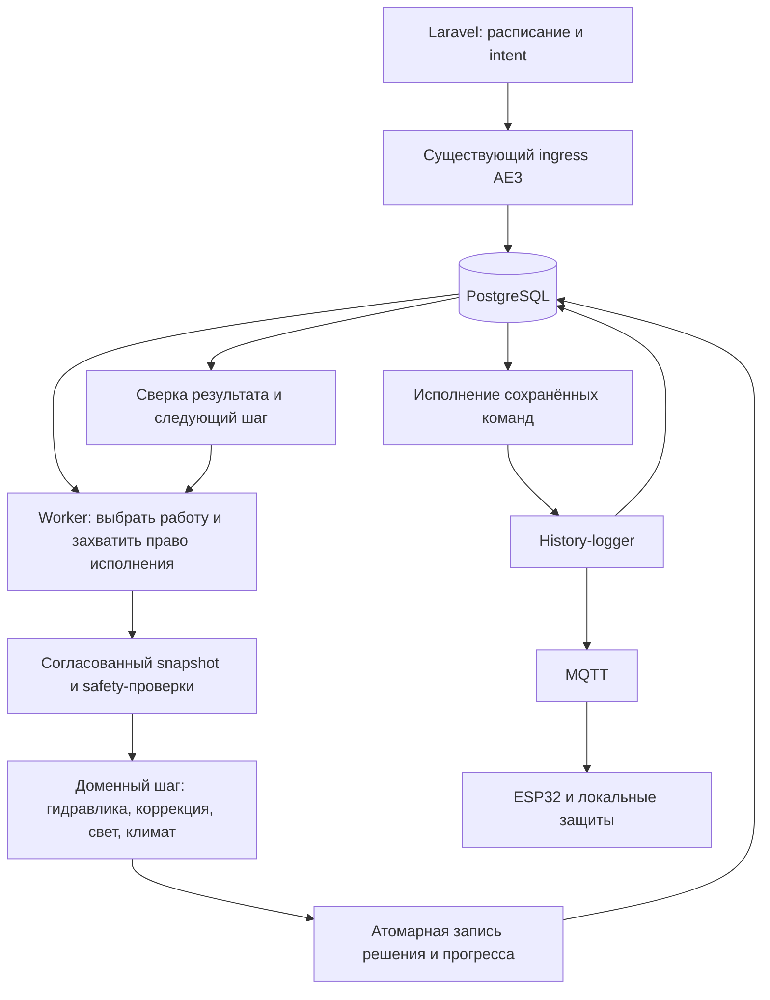

> АРХИВ. Не исполнять шаги и промпты этого файла. Это не очередь работ.

---
name: Аудит архитектуры и исполнения AE3
description: Разбор текущего automation-engine, воспроизведённых дефектов и предложения по эволюции исполнения.
version: 1.0.0
last_updated: 2026-10-03
maintained_by: Hydro 2.0
status: guide
---

# Аудит архитектуры и исполнения AE3

**Дата:** 2026-10-03. **Проверенный commit:** `3c04c3fe`.
**Не исполнять.** Отчёт на коммите `3c04c3fe`. Найденные F1–F6 закрыты планом укрепления и коммитом `a9ac23fd`. Предложения из раздела «Предлагаемая архитектура» в код не переносить.

**Статус:** аналитический отчёт, не canonical runtime-контракт и не очередь.

## Цель и границы

Запрос: изучить automation-engine, оценить и раскритиковать реализацию, предложить архитектуру и способ исполнения.
Критерий результата: выводы со ссылками на код, различение воспроизведённых дефектов и рисков, схема целевого исполнения, последовательность внедрения и проверки.

Изучены центральные пути `ae3lite`: bootstrap/worker, claim/execute/router/recovery, PostgreSQL repositories, command gateway, snapshot, correction и greenhouse climate. Это выборочный архитектурный аудит, не построчное ревью всех файлов.
Runtime-код, миграции, настройки работающего сервиса и оборудование не изменялись. Изменены только этот отчёт и навигационные индексы.

Связанные документы:

- [AE3 canonical](ae3lite.md).
- [Потоки](../ARCHITECTURE_FLOWS.md).
- [Read-model](LARAVEL_AE3_READ_MODEL_CONTRACT.md).
- [History-logger API](HISTORY_LOGGER_API.md).
- [Модель данных](../05_DATA_AND_STORAGE/DATA_MODEL_REFERENCE.md).
- [Коррекция](../06_DOMAIN_ZONES_RECIPES/CORRECTION_CYCLE_SPEC.md), [PID](../06_DOMAIN_ZONES_RECIPES/PID_CONFIG_REFERENCE.md).

Предложение сохраняет существующие сервисы, task types, authority document types и pipeline. Добавление полей или изменение семантики FSM потребует отдельного изменения canonical-спецификаций и Laravel-миграций. Настоящий отчёт таких изменений не вводит.

## Оценка

У AE3 хорошая предметная основа и значительный объём защитной логики. Главный недостаток — надёжность исполнения обеспечивается многими взаимосвязанными ветвями, а несколько ключевых гарантий нарушены на их стыках.

Рекомендация: сохранить доменные алгоритмы и развивать текущий AE3, сосредоточив владение задачей, атомарные переходы и обработку отказа в небольшом ядре. Полная перепись увеличит риск потерять уже закодированные ограничения оборудования и химии.

Что уже сделано правильно:

- PostgreSQL хранит прогресс; уведомления ускоряют обработку, polling остаётся резервным механизмом.
- Partial unique index запрещает две активные задачи зоны; есть claim через `SKIP LOCKED`, lease и CAS-проверки.
- У команд есть локальный журнал `ae_commands`, стабильные идентификаторы при ряде повторов и обработка неопределённого результата публикации.
- Единственная точка MQTT-публикации — history-logger; `ACK` не считается успешным terminal outcome.
- `TopologyPack`, typed `RuntimePlan`, `StageOutcome` уже задают полезные границы декомпозиции.
- Коррекция учитывает задержку процесса: `dose → hold → observe → decide`, калибровки, окно телеметрии и no-effect. Такую основу стоит сохранить.
- Есть содержательные тесты с настоящим PostgreSQL, включая окна сбоя публикации и recovery.

## Приоритетные находки

Приоритет P1 означает существенную проблему корректности/безопасного исполнения; P2 — архитектурный риск или рассогласование, требующее планового исправления. Вероятность аварии на реальном оборудовании этим аудитом не измерялась.

### F1 · P1 · Ошибка preflight обходит безопасную остановку

В [execute_task.py](../../backend/services/automation-engine/ae3lite/application/use_cases/execute_task.py), `run()`, вызов `_preflight_required_nodes_online()` расположен после `mark_running`, но **до** `try`, в котором выполняется `_attempt_fail_safe_shutdown()`.

Если этот вызов выбрасывает исключение, управление уходит в worker. Его `_fail_task_after_execution_crash()` записывает `failed`, синхронизирует intent и освобождает lease; вызова command gateway в этой ветке нет.

Опасный сценарий: предыдущая стадия уже включила поток и сохранила следующую check-stage, а на следующем проходе preflight обнаруживает недоступный обязательный узел. На этом пути AE не пытается выключить остальные доступные исполнительные устройства. Firmware guard может ограничить последствия, но это самостоятельный защитный механизм.

**Проверка:** изолированно внедрено исключение в preflight; основной shutdown-handler не вызван. Затем вызвана аварийная ветка worker с записывающим mock gateway: задача помечена failed, lease освобождена, gateway не вызван. Команды оборудованию не отправлялись.

**Исправление:** единая внешняя граница failure handling, покрывающая preflight и исполнение. Решение о необходимой остановке должно учитывать persisted stage/предыдущие эффекты и работать даже без успешно построенного snapshot.

### F2 · P1 · Старый исполнитель принимает идентичность нового владельца

В [workflow_router.py](../../backend/services/automation-engine/ae3lite/application/use_cases/workflow_router.py), `_resolve_stage_owner()`, stale `task.claimed_by` заменяется свежим значением из БД. Затем оно используется для `update_stage`, хотя сам результат handler рассчитан старым исполнителем по старому состоянию.

Последовательность риска: исполнитель A рассчитал outcome → задача перехвачена B → A читает имя B → A предъявляет его CAS-проверке и пытается записать свой outcome. Идентичность владельца перестаёт доказывать право текущего исполнения на запись.

**Проверка:** метод для задачи `worker-A` при строке БД `worker-B` вернул `worker-B`. Более того, существующий тест `test_router_enter_correction_reloads_owner_from_db_when_stale` прямо закрепляет эту подстановку. Реальная гонка двух процессов не запускалась.

**Исправление:** immutable token конкретного захвата и expected task revision. Смена владельца/поколения означает отказ от stale outcome; передача исполнения оформляется явным новым захватом. Нельзя лечить CAS miss подстановкой чужого owner.

Дополнительный риск: `runtime/env.py` задаёт постоянный default `ae3-runtime-worker`, Compose использует `ae3-${HOSTNAME:-...}`. Это не уникальный идентификатор запуска процесса. Однако canonical v1 разрешает только одну активную реплику: текущую конфигурацию нельзя представлять как уже поддерживающую горизонтальное масштабирование.

### F3 · P1 · Компенсационный откат стадии не проходит собственную CAS-проверку

В `WorkflowRouter._apply_transition()` сначала сохраняется `ae_tasks`, затем отдельно — `zone_workflow_state`. При ошибке второй записи `_persist_workflow_phase_sync()` пытается вернуть прежнюю стадию через `update_stage`.

Но [automation_task_repository.py](../../backend/services/automation-engine/ae3lite/infrastructure/repositories/automation_task_repository.py), `update_stage()`, первой записью уже установил `status='pending'` и `claimed_by=NULL`. Повторный вызов требует прежнего owner и статус `claimed|running|waiting_command`. При обычной последовательности без нового claim его WHERE не совпадает.

**Проверка на PostgreSQL `hydro_test`:** созданы изолированные fixtures; задача переведена из `startup` в `clean_fill_start`; в sync внедрена ошибка; rollback дал CAS miss; задача осталась `pending/clean_fill_start`. Fixtures удалены. Внешние команды не публиковались.

Существующий unit-тест проверяет два вызова mock `update_stage`, но не реальную возможность второй записи. Это пример зелёного теста, который не доказывает заявленную гарантию.

**Исправление:** task stage, workflow phase и обязательные данные перехода записывать одной короткой PostgreSQL-транзакцией. Внешний HTTP не включать в эту транзакцию. Пока обе записи участвуют в принятии решений, eventual consistency между ними требует отдельного явного протокола; текущая компенсация его не обеспечивает.

### F4 · P1 · Климатический контур игнорирует потерю lease

В [greenhouse_climate/run_tick.py](../../backend/services/automation-engine/ae3lite/greenhouse_climate/run_tick.py), `_renew_greenhouse_lease()` возвращает `bool`. `_wait_command_terminal()` не проверяет результат `await lease_renew()`, а исключения лишь пишет в debug log. После успешного DONE внешний цикл может перейти к следующей форточке.

**Проверка:** при `lease_renew=False` и ответе команды `DONE` функция вернула `DONE`. Это воспроизведение локальной семантики, не испытание конкурентных приводов.

**Исправление:** потеря владения запрещает дальнейшие обычные команды и запись успешного результата от старого исполнителя. Для климата нужна своя политика безопасного положения с учётом ветра, дождя и температуры; копировать hydraulic `all-off` сюда нельзя.

### F5 · P2 · Объявленный whole-task timeout фактически ограничивает один проход

[worker.py](../../backend/services/automation-engine/ae3lite/runtime/worker.py), `_execute_claimed_task()`, каждый раз передаёт полный `AE_MAX_TASK_EXECUTION_SEC` в `asyncio.wait`. `ExecuteTaskUseCase.run()` исполняет одну стадию; `poll/transition` снова переводят ту же задачу в pending.

Следовательно, последовательность коротких проходов не исчерпывает этот общий лимит: при новом claim отсчёт начинается заново. Это расходится с формулировкой whole-task в [ARCHITECTURE_FLOWS.md](../ARCHITECTURE_FLOWS.md). Существующие stage deadlines и scheduler stale-checks остаются действующими, поэтому вывод «задача обязательно бесконечна» не следует.

**Исправление:** разделить предельное время одного исполнения, дедлайн стадии, deadline команды и deadline всей задачи. Последний должен быть persisted и сохраняться при requeue/restart. Его бюджет необходимо согласовать с длительными стадиями и operator/manual ожиданием: просто применить 900 секунд ко всему workflow будет изменением поведения.

### F6 · P2 · Транзакция snapshot не обеспечивает единый снимок чтения

[zone_snapshot_read_model.py](../../backend/services/automation-engine/ae3lite/infrastructure/read_models/zone_snapshot_read_model.py) использует несколько SELECT внутри `conn.transaction()` без явного isolation. В проверенной тестовой БД `SHOW default_transaction_isolation` вернул `read committed`; `common.db` не устанавливает другой уровень для pool.

При этом уровне последовательные SELECT одной транзакции могут видеть разные зафиксированные состояния. Это штатная [семантика PostgreSQL](https://www.postgresql.org/docs/current/transaction-iso.html#XACT-READ-COMMITTED), а не дефект СУБД. Проверка bundle revision уже есть и полезна, но не делает весь составной snapshot согласованным.

**Исправление:** короткий read-only `REPEATABLE READ` для составного снимка либо единый SQL-запрос, где это разумно. Для телеметрии всё равно проверять timestamps/freshness; непосредственно перед эффектом отдельно валидировать текущее владение и safety-сигналы. Согласованность снимка не означает его актуальность навсегда.

## Архитектурная критика

### Концентрация обязанностей

В Python-файлах `ae3lite` на проверенном commit — **48 659 физических строк**, включая комментарии и пустые строки, без tests и общего пакета `common`.

| Файл | Строк | Что требует разделения |
|---|---:|---|
| `handlers/correction.py` | 3 861 | FSM, дозирование, наблюдение, PID persistence, events, alerts |
| `handlers/base.py` | 2 468 | Probe, levels, targets, hot reload, режимы, safety |
| `domain/services/correction_planner.py` | 1 865 | PID math, модель процесса, политики компонентов, clamps |
| `runtime/worker.py` | 1 820 | Concurrency, heartbeat, recovery, replay intents, alerts, lifecycle |
| `use_cases/execute_task.py` | 1 621 | Snapshot, execution, retry, shutdown, диагностика и завершение |
| `greenhouse_climate/run_tick.py` | 1 313 | Собственная инфраструктура lease, polling и результата |

Размер сам по себе не является ошибкой. Проблема в том, что для доказательства «после потери владения не будет новой дозы» приходится читать worker, gateway, router, handlers и recovery. F1–F4 показывают реальные последствия таких границ.

`BaseStageHandler` постепенно превращается в общий объект со многими обязанностями. Вместо дальнейшего роста наследования нужны небольшие зависимости: чтение наблюдений, политика safety, применение конфигурации, исполнение команд. Существующие `DecisionWindowReader`, `SensorModeController`, `CorrectionTransitionPolicy` — хорошее начало.

### Слишком много мест восстанавливают одно исполнение

Startup recovery, waiting-command reconcile, stale janitor, worker и gateway имеют пересекающееся знание о командах и переходах. Нужен общий механизм применения результата эффекта и завершения задачи; источники вызова могут остаться разными.

Не следует механически сливать всё в ещё один крупный recovery-класс. Цель — общие небольшие операции с явными предусловиями и одна политика повторного исполнения опасного действия.

### Журнал команд надо сделать семантически неизменяемым

В `PgAeCommandRepository.allocate_and_create_pending()` при повторном использовании pending/published_unconfirmed строки обновляется payload. Если заново построенный план изменится, старый cmd_id может соответствовать новому локальному payload. Факт ошибочной дозы этим аудитом не воспроизведён; это риск контракта повторной доставки.

Предпочтительная гарантия: одинаковый effect identity всегда означает одинаковые node/channel/cmd/params. При расхождении — явный конфликт, а не перезапись. Новый осознанный импульс получает новую identity; retry незавершённого импульса сохраняет прежнюю.

### Документация местами противоречит коду и сама себе

- README сервиса всё ещё описывает удалённые top-level repositories/services/CommandBus и устаревшие task types.
- `ae3lite.md` говорит о pH-only на поливе; текущий `irrigation_check.py` допускает EC для `calcium|npk` при соответствующем `irrigation_ec_component`. В `CORRECTION_CYCLE_SPEC.md` одна таблица уже отражает это поведение, но остаются старые pH-only формулировки.
- Ссылка навыка PID на `.qoder/specs/ae3-cross-coupled-pid-calibration-implementation-plan.md` не найдена; выводы строились по существующим canonical-документам и коду.

Нельзя незаметно выбирать удобную трактовку защищённого контракта. Перед реализацией изменений требуется отдельная сверка, какие режимы химии должны поддерживаться; в этом аудите химическая политика не менялась.

## Предлагаемая архитектура

Один существующий сервис AE3, одна активная production-реплика по текущему канону, ограниченная параллельность между зонами. Внутри — небольшое устойчивое ядро исполнения и доменные модули с явными входами/выходами.



Блоки схемы — модули внутри существующих процессов. Дополнительные сервисы, универсальная outbox/domain-events платформа, новый scheduler или редактор графов здесь не предлагаются. Для сохранения команд используется существующая `ae_commands`.

| Модуль | Ответственность |
|---|---|
| Worker | Выбрать due task, ограничить concurrency, обеспечить остановку процесса |
| Execution ownership | Захват, продление, проверка поколения исполнения, отказ от stale результата |
| Snapshot reader | Согласованное чтение конфигурации/состояния; явные времена наблюдений |
| Domain step | Вычислить следующий переход, ожидание или команды из состояния и наблюдения |
| Transition writer | Атомарно сохранить task/workflow и необходимые изменения журнала |
| Command executor | Доставить сохранённую неизменяемую команду через HL, сверить результат |
| Failure coordinator | Применить доменную safe-stop политику и сохранить итог безопасности |
| Recovery | Прочитать незавершённое исполнение и вызвать те же механизмы сверки/перехода |

Условный интерфейс доменного шага: `decide(state, observation, config, now) -> decision`. Решение содержит изменение состояния, описание команд и время следующей проверки. Доменный шаг не выполняет HTTP, sleep и SQL. Это эволюция существующих planner/StageOutcome, а не второй runtime рядом с ними.

### Как исполняется один шаг

1. В короткой транзакции получить право на due task. Идентификатор запуска процесса уникален; захват имеет собственное поколение. Claim task и lease согласовать в одной транзакции либо доказать эквивалентный протокол.
2. Прочитать согласованный snapshot; зафиксировать revision конфигурации, identity наблюдения и дедлайны. Сохранить текущую семантику locked/live: live-изменения принимать в определённых checkpoint, логируя revision.
3. Рассчитать доменное решение. Коррекция сохраняет существующую последовательность и ограничения; математика не смешивается с транспортом.
4. Одной транзакцией проверить исходное поколение/версию и записать переход, workflow phase и необходимые строки команд. Если право потеряно — результат расчёта отбросить. Сетевой вызов внутри транзакции запрещён.
5. Доставить сохранённую команду через history-logger. Результат transport timeout означает «неизвестно», а не «точно не исполнено». До решения о новой дозе сверить прежний cmd_id и доступные подтверждения.
6. Ожидание terminal/observe оформить persisted временем следующей проверки. При освобождении coroutine нельзя разрешать другой активной задаче управлять той же зоной: admission удерживается active-task ограничением и политикой владения ресурсом.
7. По terminal результату применить ту же функцию перехода, которую вызывает recovery. Успех устройства — только DONE; новые стадии не возникают только потому, что HTTP вернул 200.
8. При ошибке выполнить предметную safe-stop политику, записать её подтверждение или неопределённость, завершить задачу и согласовать intent. Неизвестное физическое состояние должно блокировать новое опасное исполнение даже после terminal статуса задачи.

Нельзя обещать exactly-once физическое действие лишь на основании записи в PostgreSQL. Проверка owner перед HTTP тоже оставляет окно гонки. В пределах нынешнего single-replica контракта нужны поколение захвата, строгий CAS, неизменяемая команда и recovery. Полноценное ограждение старых исполнителей на границе HL/устройства потребует отдельного согласованного изменения защищённых контрактов; оно не входит в первый рефакторинг.

### Граница safety и физического управления

Нужно различать результат задачи и подтверждённое состояние оборудования. `task.failed` не доказывает, что насос выключен. Достаточно трёх внутренних исходов safety: остановка подтверждена, остановка ожидает подтверждения, состояние неизвестно. Их отображение в текущие таблицы/alerts/API нужно специфицировать до изменения схемы.

Firmware сохраняет независимые timeout/level/E-Stop защиты. AE отвечает за межустройственные правила, попытку управляемой остановки и запрет дальнейшей автоматизации при неопределённом результате. Недоступность БД или сети не должна интерпретироваться как подтверждение безопасного состояния.

### Коррекция и PID

Сохранить `CorrectionPlanner`, observation windows, калибровки, hold/no-effect и последовательный nutrient pipeline. Выделить вычисление дозы и обработку наблюдения в функции с явными входами и выходами; запись `pid_state` связать с применением подтверждённого результата команды.

Дальнейшую настройку коэффициентов оценивать по записанным рядам измерений: overshoot, время достижения допуска, суммарная доза, число no-effect, частота выхода за пределы. В этом аудите качество регулирования на реальном растворе не измерялось; наличие PID и большой тестовой базы само по себе его не доказывает.

## Порядок реализации

| Этап | Изменение | Критерий завершения |
|---|---|---|
| 1. Локальные исправления | F1 и F4; отказ от подстановки чужого owner; уникальная process identity | Исключение preflight проходит safety-path; loss lease запрещает следующий эффект; stale outcome отвергается |
| 2. Атомарные переходы | F3; transaction API репозиториев; согласованные task/workflow записи | При ошибке второй записи обе записи откатываются в настоящем PostgreSQL |
| 3. Время и snapshot | F5/F6; явная семантика четырёх дедлайнов; согласованное чтение | Requeue/restart не обнуляют общий бюджет; concurrent config update не смешивает revisions |
| 4. Журнал команд | Неизменяемый payload; явная identity импульса; единая сверка terminal | Сбой до/после HL publish и DONE не создаёт лишнюю дозу |
| 5. Декомпозиция | Domain decisions, небольшие safety/observation/config зависимости, общий механизм recovery | Обычный запуск и recovery применяют одинаковые переходы для одинакового persisted state |
| 6. Сверка контрактов | Canonical docs, README, UI/read-model при необходимости | Документация описывает реальное разрешённое поведение, существующий pipeline сохранён |

Сверку защищённого контракта выполнять **внутри каждого соответствующего этапа до/вместе с кодом**; последний этап — итоговая проверка, а не отложенное документирование. Любое изменение схемы — только Laravel migrations.

Сначала исправлять доказанные нарушения, затем менять структуру. Один небольшой этап за раз; переходы на stage boundaries вводить без одновременного изменения химических алгоритмов. Внедрение выполнять при отсутствии активных задач/lease с узким стендовым прогоном и проверяемым rollback; параллельный runtime не создавать.

## Проверки и ограничения результата

В Docker выполнены две выборки pytest с `AE3_PYTEST_DB=hydro_test`:

```bash
docker compose -f backend/docker-compose.dev.yml exec -T \
  -e AE3_PYTEST_DB=hydro_test automation-engine pytest -q \
  tests/unit/test_ae3lite_lease_heartbeat_fail_closed.py \
  tests/unit/test_ae3lite_claim_next_task.py \
  tests/unit/test_ae3lite_execute_task.py \
  tests/unit/test_ae3lite_startup_recovery_crash_windows.py \
  tests/unit/test_ae3lite_command_idempotency.py \
  tests/unit/test_ae3lite_runtime_worker_integration.py

docker compose -f backend/docker-compose.dev.yml exec -T \
  -e AE3_PYTEST_DB=hydro_test automation-engine pytest -q \
  tests/unit/test_ae3lite_correction_planner.py \
  tests/unit/test_ae3lite_correction_handler.py \
  tests/unit/test_ae3lite_workflow_router.py \
  tests/unit/test_ae3lite_workflow_topology.py \
  tests/unit/test_ae3lite_safety_guards.py \
  tests/unit/test_ae3lite_stale_task_reconcile.py \
  tests/unit/test_ae3lite_foreign_lease_reconcile.py \
  tests/unit/test_ae3lite_zone_snapshot_read_model_integration.py
```

Результат: **81 passed + 278 passed = 359 passed**. В этих интеграционных сценариях HL заменён заглушками, часть проверок доступности узлов также подменяется fixtures. Зелёный результат не означает проверки физических эффектов.

Дополнительно выполнены четыре одноразовых проверки через Python внутри контейнера: F1, F2, F4 с mocks и F3 с реальным репозиторием в `hydro_test`. Они подтверждают описанные ветви, а не весь аварийный сценарий end-to-end. Скрипты не добавлены в runtime или постоянный suite; при исправлении каждое воспроизведение должно стать регрессионным тестом требуемого поведения.

Не выполнялись полный pytest suite, Laravel tests, Playwright, realhw, нагрузочные испытания и испытания двух процессов. Runtime не изменялся; эти проверки потребуются для реализации и допуска к эксплуатации.

Дополнительные обязательные сценарии будущих изменений: потеря lease между командами batch; отмена после publish до link; repeated DONE; рестарт во время hold; crash между task/workflow writes; исчерпание общего deadline через много requeue; DB недоступна при остановке; E-Stop одновременно с очередной дозой. Все опасные эффекты в первых проверках должны заменяться записывающим транспортом.
