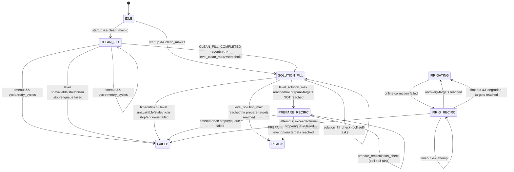

# TWO_TANK_RUNTIME_LOGIC_CURRENT.md
# Текущая runtime-логика 2-баковой схемы (automation-engine)

**Версия:** 1.0  
**Дата обновления:** 2026-02-19  
**Статус:** Актуальная фиксация текущей реализации

Compatible-With: Protocol 2.0, Backend >=3.0, Python >=3.0, Database >=3.0, Frontend >=3.0.

---

## 1. Цель

Зафиксировать текущую (as-is) реализацию 2-бакового workflow в `backend/services/automation-engine`:
- маршрутизацию и валидацию payload;
- state-machine startup/recovery;
- условия переходов;
- командные планы;
- таймауты, retry, fail-safe.

Документ описывает текущее поведение кода, без проектных изменений.

---

## 2. Контекст и границы

- Топология runtime: `two_tank_drip_substrate_trays`.
- Базовый маршрут diagnostics:
  `Scheduler task -> automation-engine -> history-logger (/commands) -> MQTT -> ESP32`.
- Публикация команд на ноды выполняется через `history-logger`; прямой MQTT publish из automation-engine не используется.
- Нода обязана поддерживать локальный auto-stop наполнения по `*_max` датчикам (см. ссылки внизу).

---

## 3. Входной контракт (основное)

Минимально важные поля execution для 2-бакового режима:
- `subsystems.diagnostics.execution.topology = "two_tank_drip_substrate_trays"`
- `subsystems.diagnostics.execution.workflow` (startup/check/recovery workflow)
- `subsystems.diagnostics.execution.startup.*` (таймауты/poll/retry/labels/threshold)
- `subsystems.diagnostics.execution.two_tank_commands.*` (command plans)
- `subsystems.diagnostics.execution.irrigation_recovery.*` (timeout/attempts/tolerances)

Нормализация workflow:
- `cycle_start -> startup`
- `refill_check -> clean_fill_check`

---

## 4. Канонические фазы и workflow-stage

Доменные фазы:
- `idle`
- `tank_filling`
- `tank_recirc`
- `ready`
- `irrigating`
- `irrig_recirc`

Для 2-бакового workflow поддерживаются stages:
- `startup`
- `clean_fill_check`
- `solution_fill_check`
- `prepare_recirculation`
- `prepare_recirculation_check`
- `irrigation_recovery`
- `irrigation_recovery_check`

---

## 5. State-machine (as-is)

---

## 6. Логика этапов

### 6.1 Startup

1. `startup`:
   - читается `clean_max` датчик через `_read_level_switch`;
   - при `is_triggered=true` сразу стартует `solution_fill`;
   - иначе стартует `clean_fill` (cycle=1).

2. `clean_fill_check`:
   - fast-path: ищется `CLEAN_FILL_COMPLETED` event;
   - fallback: проверка `level_clean_max`;
   - при подтверждении выполняется stop `clean_fill` и переход в `solution_fill`;
   - при timeout: stop + retry до `clean_fill_retry_cycles`, затем fail.

3. `solution_fill_check`:
   - fast-path: `SOLUTION_FILL_COMPLETED`;
   - fallback: `level_solution_max`;
   - при подтверждении: stop `solution_fill` + `sensor_mode deactivate`;
   - затем оценка prepare-targets (PH/EC):
     - `targets_reached=true` -> `ready`;
     - иначе -> `prepare_recirculation`.

4. `prepare_recirculation_check`:
   - подтверждение по `PREPARE_TARGETS_REACHED` или по вычисленным PH/EC targets;
   - при успехе stop + `sensor_mode deactivate` + `ready`;
   - при timeout -> fail `prepare_npk_ph_target_not_reached`.

### 6.2 Recovery после ошибки online irrigation correction

1. При ошибке полива из списка terminal error-code запускается переход в
   `irrigation_recovery` (`tank_to_tank_correction_started`).
2. `irrigation_recovery_check`:
   - если strict recovery target достигнут -> stop + `sensor_mode deactivate` + `irrigating`;
   - при timeout:
     - если degraded target достигнут -> `irrigating` (degraded completion);
     - иначе retry до `max_continue_attempts`;
     - при исчерпании попыток -> fail `irrigation_recovery_attempts_exceeded`.

---

## 7. Command plans (дефолт)

`clean_fill_start/stop`:
- `valve_clean_fill` true/false.

`solution_fill_start`:
- `valve_clean_supply=true`
- `valve_solution_fill=true`
- `pump_main=true`

`solution_fill_stop`:
- `pump_main=false`
- `valve_solution_fill=false`
- `valve_clean_supply=false`

`prepare_recirculation_start`:
- `valve_solution_supply=true`
- `valve_solution_fill=true`
- `pump_main=true`

`prepare_recirculation_stop`:
- `pump_main=false`
- `valve_solution_fill=false`
- `valve_solution_supply=false`

`irrigation_recovery_start`:
- `valve_irrigation=false`
- `valve_solution_supply=true`
- `valve_solution_fill=true`
- `pump_main=true`

`irrigation_recovery_stop`:
- `pump_main=false`
- `valve_solution_fill=false`
- `valve_solution_supply=false`

---

## 8. Тайминги и пороги (defaults)

- `clean_fill_timeout_sec = 1200`
- `solution_fill_timeout_sec = 1800`
- `prepare_recirculation_timeout_sec = 1200`
- `irrigation_recovery_timeout_sec = 600`
- `irrigation_recovery_max_attempts = 5`
- `clean_fill_retry_cycles = 1`
- `level_poll_interval_sec = 60` (через runtime default)
- `level_switch_on_threshold = 0.5`
- prepare tolerance: `EC=25%`, `PH=15%`
- recovery tolerance: `EC=10%`, `PH=5%`
- degraded tolerance: `EC=20%`, `PH=10%`

---

## 9. Fail-safe и валидация

1. Fail-closed по payload:
   - `invalid_payload_contract_version`
   - `invalid_payload_missing_topology`
   - `invalid_payload_missing_workflow`
   - `unsupported_workflow`

2. Fail-closed по телеметрии уровней/метрик:
   - отсутствие уровня -> `two_tank_level_unavailable`
   - stale при enforce freshness -> `two_tank_level_stale`

3. Fail-closed по командам:
   - успех команды считается только при terminal status из accepted набора (по умолчанию `DONE`);
   - partial/failed dispatch даёт `two_tank_command_failed`/детализированные command error codes.

4. Safety guard при timeout-stop:
   - если timeout произошёл и stop не подтверждён, ветка возвращает `*_stop_not_confirmed` режим и блокирует опасный рестарт.

5. Компенсация при ошибке enqueue после старта:
   - выполняется compensating stop и `sensor_mode deactivate`.

---

## 10. Особенности источников подтверждения наполнения

Подтверждение завершения fill может прийти из двух каналов:

1. Событие ноды (fast-path):
   - `storage_state/event` с `event_code` (`clean_fill_completed`, etc.),
   - нормализация в `zone_events.type`.

2. Poll датчика уровня (fallback):
   - `level_clean_max` / `level_solution_max` через `telemetry_last`;
   - при отсутствии last-value используется fallback на последнюю запись `telemetry_samples`.

Оба канала используются параллельно: событие ускоряет переход, poll остаётся резервом.

---

## 11. Где смотреть в коде

- Router/validation:
  - `backend/services/automation-engine/application/workflow_validator.py`
  - `backend/services/automation-engine/application/workflow_router.py`
  - `backend/services/automation-engine/application/diagnostics_task_execution.py`
- Input normalization:
  - `backend/services/automation-engine/domain/policies/workflow_input_policy.py`
- Two-tank core/workflows:
  - `backend/services/automation-engine/domain/workflows/two_tank_core.py`
  - `backend/services/automation-engine/domain/workflows/two_tank_startup_core.py`
  - `backend/services/automation-engine/domain/workflows/two_tank_recovery_core.py`
- Runtime config / phase starters:
  - `backend/services/automation-engine/application/two_tank_runtime_config.py`
  - `backend/services/automation-engine/application/two_tank_phase_starters.py`
  - `backend/services/automation-engine/application/two_tank_enqueue.py`
  - `backend/services/automation-engine/application/two_tank_compensation.py`
- Telemetry/targets:
  - `backend/services/automation-engine/infrastructure/telemetry_query_adapter.py`
  - `backend/services/automation-engine/domain/policies/target_evaluation_policy.py`
- Command publish path:
  - `backend/services/automation-engine/infrastructure/command_bus.py`
  - `backend/services/automation-engine/application/command_publish_batch.py`

---

## 12. Связанные спецификации

- `doc_ai/04_BACKEND_CORE/SCHEDULER_AUTOMATION_TASK_EXECUTION_SCHEMA.md`
- `doc_ai/04_BACKEND_CORE/API_SPEC_FRONTEND_BACKEND_FULL.md`
- `doc_ai/03_TRANSPORT_MQTT/MQTT_SPEC_FULL.md`
- `doc_ai/03_TRANSPORT_MQTT/BACKEND_NODE_CONTRACT_FULL.md`
- `doc_ai/03_TRANSPORT_MQTT/MQTT_NAMESPACE.md`
- `doc_ai/02_HARDWARE_FIRMWARE/NODE_CHANNELS_REFERENCE.md`

