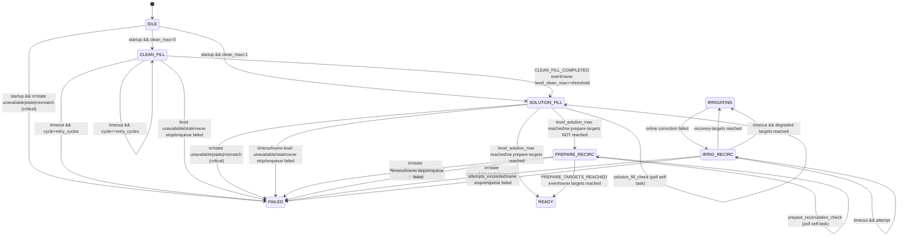

# TWO_TANK_RUNTIME_LOGIC_CURRENT.md
# Текущая runtime-логика 2-баковой схемы (automation-engine)

**Версия:** 1.0  
**Дата обновления:** 2026-02-19  
**Статус:** Историческая фиксация pre-AE2-Lite (as-is snapshot)

Compatible-With: Protocol 2.0, Backend >=3.0, Python >=3.0, Database >=3.0, Frontend >=3.0.

> Примечание: каноничная реализация для нового runtime описана в
> `doc_ai/10_AI_DEV_GUIDES/AE2_LITE_IMPLEMENTATION_PLAN.md`.
> Этот документ сохранен как исторический снимок и не задает актуальный API-контракт.

---

## 1. Цель

Зафиксировать текущую (as-is) реализацию 2-бакового workflow в `backend/services/automation-engine`:
- маршрутизацию и валидацию payload;
- state-machine startup/recovery;
- условия переходов;
- командные планы;
- таймауты, retry, fail-safe.

Документ описывает текущее поведение кода, без проектных изменений.

---

## 2. Контекст и границы

- Топология runtime: `two_tank_drip_substrate_trays`.
- Базовый маршрут diagnostics (исторический):
  `Scheduler task -> automation-engine -> history-logger (/commands) -> MQTT -> ESP32`.
- Публикация команд на ноды выполняется через `history-logger`; прямой MQTT publish из automation-engine не используется.
- Нода обязана поддерживать локальный auto-stop наполнения по `*_max` датчикам (см. ссылки внизу).

---

## 3. Входной контракт (основное)

Минимально важные поля execution для 2-бакового режима:
- `subsystems.diagnostics.execution.topology = "two_tank_drip_substrate_trays"`
- `subsystems.diagnostics.execution.workflow` (startup/check/recovery workflow)
- `subsystems.diagnostics.execution.startup.*` (таймауты/poll/retry/labels/threshold)
- `subsystems.diagnostics.execution.two_tank_commands.*` (command plans)
- `subsystems.diagnostics.execution.irrigation_recovery.*` (timeout/attempts/tolerances)

Нормализация workflow:
- legacy-алиасы не используются; ожидаются только канонические workflow-stages.

---

## 4. Канонические фазы и workflow-stage

Доменные фазы:
- `idle`
- `tank_filling`
- `tank_recirc`
- `ready`
- `irrigating`
- `irrig_recirc`

Для 2-бакового workflow поддерживаются stages:
- `startup`
- `manual_step`
- `clean_fill_check`
- `solution_fill_check`
- `prepare_recirculation`
- `prepare_recirculation_check`
- `irrigation_recovery`
- `irrigation_recovery_check`

---

## 5. State-machine (as-is)

---

## 6. Логика этапов

### 6.1 Startup

1. `startup`:
   - читается `clean_max` датчик через `_read_level_switch`;
   - при `is_triggered=true` сразу стартует `solution_fill`;
   - иначе стартует `clean_fill` (cycle=1).

2. `clean_fill_check`:
   - fast-path: ищется `CLEAN_FILL_COMPLETED` event;
   - fallback: проверка `level_clean_max`;
   - при подтверждении выполняется stop `clean_fill` и переход в `solution_fill`;
   - при `max=1 && min=0` -> fail `sensor_state_inconsistent` (остановка цикла);
   - при timeout: stop + retry до `clean_fill_retry_cycles`, затем fail.

3. `solution_fill_check`:
   - fast-path: `SOLUTION_FILL_COMPLETED`;
   - fallback: `level_solution_max`;
   - при подтверждении: stop `solution_fill` + `sensor_mode deactivate`;
   - затем оценка prepare-targets (PH/EC):
     - `targets_reached=true` -> `ready`;
     - иначе -> `prepare_recirculation`.

4. `prepare_recirculation_check`:
   - подтверждение по `PREPARE_TARGETS_REACHED` или по вычисленным PH/EC targets;
   - при успехе stop + `sensor_mode deactivate` + `ready`;
   - при timeout -> fail `prepare_npk_ph_target_not_reached`.

### 6.2 Recovery после ошибки online irrigation correction

1. При ошибке полива из списка terminal error-code запускается переход в
   `irrigation_recovery` (`tank_to_tank_correction_started`).
2. `irrigation_recovery_check`:
   - если strict recovery target достигнут -> stop + `sensor_mode deactivate` + `irrigating`;
   - при timeout:
     - если degraded target достигнут -> `irrigating` (degraded completion);
     - иначе retry до `max_continue_attempts`;
     - при исчерпании попыток -> fail `irrigation_recovery_attempts_exceeded` + `manual_ack_required=true`.
3. Вторая попытка recovery использует увеличенный timeout:
   - `retry_timeout = base_timeout * irrigation_recovery_retry_timeout_multiplier` (по умолчанию `x1.5`).

### 6.3 Critical expected-vs-actual check (`irr/state`)

Перед выполнением workflow всегда отправляется команда `storage_state/state` на irr-ноду
(best-effort запрос snapshot), после чего для critical stages выполняется guard:
- `startup` -> ожидается `pump_main=false`
- `solution_fill_check` -> ожидается `valve_clean_supply=true`, `valve_solution_fill=true`, `pump_main=true`
- `prepare_recirculation_check` -> ожидается `valve_solution_supply=true`, `valve_solution_fill=true`, `pump_main=true`
- `irrigation_recovery_check` -> ожидается `valve_solution_supply=true`, `valve_solution_fill=true`, `valve_irrigation=false`, `pump_main=true`

Fail-closed режим:
- snapshot отсутствует -> `two_tank_irr_state_unavailable` (`irr_state_unavailable`)
- snapshot устарел (`age > irr_state_max_age_sec`) -> `two_tank_irr_state_stale` (`irr_state_stale`)
- snapshot не совпал с expected -> `two_tank_irr_state_mismatch` (`irr_state_mismatch`)

---

## 7. Command plans (дефолт)

`clean_fill_start/stop`:
- `valve_clean_fill` true/false.

`solution_fill_start`:
- `valve_clean_supply=true`
- `valve_solution_fill=true`
- `pump_main=true`

`solution_fill_stop`:
- `pump_main=false`
- `valve_solution_fill=false`
- `valve_clean_supply=false`

`prepare_recirculation_start`:
- `valve_solution_supply=true`
- `valve_solution_fill=true`
- `pump_main=true`

`prepare_recirculation_stop`:
- `pump_main=false`
- `valve_solution_fill=false`
- `valve_solution_supply=false`

`irrigation_recovery_start`:
- `valve_irrigation=false`
- `valve_solution_supply=true`
- `valve_solution_fill=true`
- `pump_main=true`

`irrigation_recovery_stop`:
- `pump_main=false`
- `valve_solution_fill=false`
- `valve_solution_supply=false`

---

## 8. Тайминги и пороги (defaults)

- `clean_fill_timeout_sec = 1200`
- `solution_fill_timeout_sec = 1800`
- `prepare_recirculation_timeout_sec = 1200`
- `irrigation_recovery_timeout_sec = 600`
- `irrigation_recovery_max_attempts = 2`
- `irrigation_recovery_retry_timeout_multiplier = 1.5`
- `clean_fill_retry_cycles = 1`
- `level_poll_interval_sec = 60` (через runtime default)
- `level_switch_on_threshold = 0.5`
- `irr_state_max_age_sec = 30`
- `irr_state_wait_timeout_sec = 2` (ожидание появления snapshot после `storage_state/state` перед fail `irr_state_unavailable`)
- prepare tolerance: `EC=25%`, `PH=15%`
- recovery tolerance: `EC=10%`, `PH=5%`
- degraded tolerance: `EC=20%`, `PH=10%`

---

## 9. API для ручного управления (AE/Laravel)

Раздел ниже исторический. В AE2-Lite canonical runtime endpoint запуска:
`POST /zones/{id}/start-cycle`.

Legacy endpoint `POST /zones/{id}/automation/manual-resume` удален и не используется.

Новые endpoint automation-engine:
- `GET /zones/{zone_id}/control-mode`
- `POST /zones/{zone_id}/control-mode` (`control_mode`: `auto|semi|manual`)
- `POST /zones/{zone_id}/manual-step` (`manual_step`: start/stop по этапам 2-баковой схемы)

Проксирование в Laravel API:
- `GET /api/zones/{zone}/control-mode`
- `POST /api/zones/{zone}/control-mode` (роль `operator`)
- `POST /api/zones/{zone}/manual-step` (роль `operator`)

Поведение:
- в `auto` manual-step запрещён (`manual_step_forbidden_in_auto_mode`);
- в `semi` и `manual` manual-step разрешён;
- в `semi` manual-step разрешён только в активных workflow-фазах
  (`tank_filling|tank_recirc|irrigating|irrig_recirc`), иначе `manual_step_zone_inactive`;
- в `manual` при `workflow_phase=idle` manual-step также разрешён (для прямого ручного управления);
- `allowed_manual_steps` рассчитывается с учетом текущей `workflow_phase` (phase-aware);
- шаг вне phase-aware списка возвращает `manual_step_not_allowed_for_phase`;
- `GET /zones/{zone_id}/state` возвращает `control_mode` и `allowed_manual_steps` для UI.

---

## 10. Fail-safe и валидация

1. Fail-closed по payload:
   - `invalid_payload_contract_version`
   - `invalid_payload_missing_topology`
   - `invalid_payload_missing_workflow`
   - `unsupported_workflow`

2. Fail-closed по телеметрии уровней/метрик:
   - отсутствие уровня -> `two_tank_level_unavailable`
   - stale при enforce freshness -> `two_tank_level_stale`

3. Fail-closed по expected-vs-actual `irr/state`:
   - `two_tank_irr_state_unavailable`
   - `two_tank_irr_state_stale`
   - `two_tank_irr_state_mismatch`

4. Отдельная ошибка согласованности датчиков:
   - `two_tank_sensor_state_inconsistent` (`sensor_state_inconsistent`)

5. Fail-closed по командам:
   - успех команды считается только при terminal status из accepted набора (по умолчанию `DONE`);
   - partial/failed dispatch даёт `two_tank_command_failed`/детализированные command error codes.

6. Safety guard при timeout-stop:
   - если timeout произошёл и stop не подтверждён, ветка возвращает `*_stop_not_confirmed` режим и блокирует опасный рестарт.

7. Компенсация при ошибке enqueue после старта:
   - выполняется compensating stop и `sensor_mode deactivate`.

---

## 11. Особенности источников подтверждения наполнения

Подтверждение завершения fill может прийти из двух каналов:

1. Событие ноды (fast-path):
   - `storage_state/event` с `event_code` (`clean_fill_completed`, etc.),
   - нормализация в `zone_events.type`.

2. Poll датчика уровня (fallback):
   - `level_clean_max` / `level_solution_max` через `telemetry_last`;
   - при отсутствии last-value используется fallback на последнюю запись `telemetry_samples`.

Оба канала используются параллельно: событие ускоряет переход, poll остаётся резервом.

Отдельно от node-event: snapshot `irr/state` сохраняется в `zone_events` с типом `IRR_STATE_SNAPSHOT`:

- из `command_response`:
  - при `cmd=state`;
  - fail-safe: также при `channel=storage_state` (даже если в записи команды `cmd` не восстановлен).
- из `storage_state/event`, если payload содержит объект `snapshot` (или `state` как fallback).

Для snapshot допускается частичный набор bool-полей (не только строго полный): critical guard в AE
сравнивает только поля, обязательные для текущего этапа, а отсутствующие трактуются как mismatch, а не unavailable.

---

## 12. Где смотреть в коде

- Router/validation:
  - `backend/services/automation-engine/application/workflow_validator.py`
  - `backend/services/automation-engine/application/workflow_router.py`
  - `backend/services/automation-engine/application/diagnostics_task_execution.py`
- Input normalization:
  - `backend/services/automation-engine/domain/policies/workflow_input_policy.py`
- Two-tank core/workflows:
  - `backend/services/automation-engine/domain/workflows/two_tank_core.py`
  - `backend/services/automation-engine/domain/workflows/two_tank_startup_core.py`
  - `backend/services/automation-engine/domain/workflows/two_tank_recovery_core.py`
- Runtime config / phase starters:
  - `backend/services/automation-engine/application/two_tank_runtime_config.py`
  - `backend/services/automation-engine/application/two_tank_phase_starters.py`
  - `backend/services/automation-engine/application/two_tank_enqueue.py`
  - `backend/services/automation-engine/application/two_tank_compensation.py`
- Telemetry/targets:
  - `backend/services/automation-engine/infrastructure/telemetry_query_adapter.py`
  - `backend/services/automation-engine/domain/policies/target_evaluation_policy.py`
- Command publish path:
  - `backend/services/automation-engine/infrastructure/command_bus.py`
  - `backend/services/automation-engine/application/command_publish_batch.py`

---

## 13. Связанные спецификации

- `doc_ai/04_BACKEND_CORE/TWO_TANK_RUNTIME_LOGIC_TARGET_SPEC.md` (target/to-be контракт)
- `doc_ai/04_BACKEND_CORE/SCHEDULER_AUTOMATION_TASK_EXECUTION_SCHEMA.md`
- `doc_ai/04_BACKEND_CORE/API_SPEC_FRONTEND_BACKEND_FULL.md`
- `doc_ai/03_TRANSPORT_MQTT/MQTT_SPEC_FULL.md`
- `doc_ai/03_TRANSPORT_MQTT/BACKEND_NODE_CONTRACT_FULL.md`
- `doc_ai/03_TRANSPORT_MQTT/MQTT_NAMESPACE.md`
- `doc_ai/02_HARDWARE_FIRMWARE/NODE_CHANNELS_REFERENCE.md`
