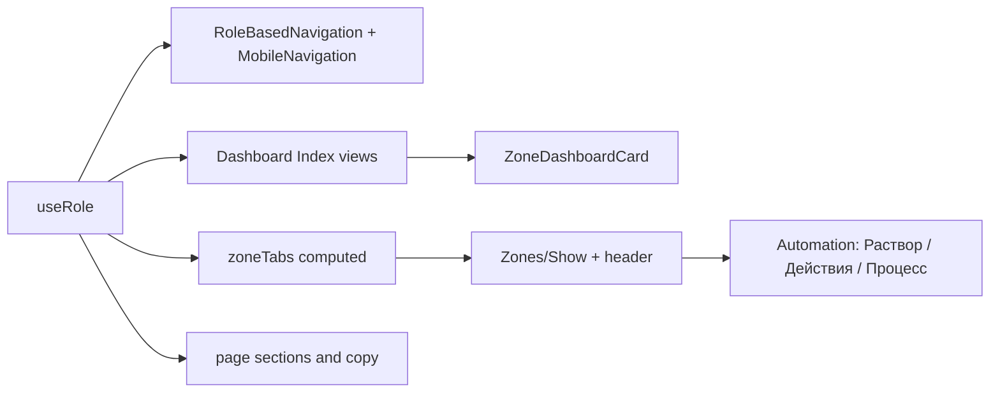

# План ролевого UI/UX и доработки страниц

**Дата:** 2026-08-19
**Версия:** 1.0
**Статус:** `plan` (к внедрению)
**Совместимость:** Compatible-With: Protocol 2.0, Backend >=3.0, Python >=3.0, Database >=3.0, Frontend >=3.0.

Канон UI: [`FRONTEND_UI_UX_SPEC.md`](FRONTEND_UI_UX_SPEC.md), [`FRONTEND_ARCH_FULL.md`](FRONTEND_ARCH_FULL.md).
Намерение ролей: [`ROLE_BASED_UI_SPEC.md`](ROLE_BASED_UI_SPEC.md) — **не** копировать устаревшие пункты (отдельные маршруты дашбордов, правку рецептов оператором, `/system`).

Источники аудита: три независимых ревью (Opus / ChatGPT / GLM) + синтез 2026-08-19.

---

## 1. Цель

Сделать production-фронтенд **рабочим местом роли**, а не одним операционным пультом с разными кнопками.

Одновременно:

1. Выровнять права (`useRole()`) с меню и страницами.
2. Сократить и сгруппировать навигацию по роли.
3. **Доработать сами страницы** (шапка, состав блоков, язык, дефолты табов), а не только сайдбар.
4. Не плодить четыре приложения и не ломать пайплайн Laravel → AE3 → history-logger → MQTT.

Целевые роли в скоупе: `operator`, `agronomist`, `engineer`, `admin`. `viewer` — read-only вариант операторского простого слоя, отдельной итерацией не делать.

---

## 2. Контекст

Сейчас:

- Canonical home — `Pages/Dashboard/Index.vue` (Unified Dashboard) для всех ролей.
- `Pages/Dashboard/Dashboards/*` существуют и **не подключены**; в них протухшие ссылки (`/admin/users`, `/system`), заглушки и неканоническая команда `MEASURE_NOW`.
- Навигация — плоский список в `RoleBasedNavigation.vue` + отдельный `MobileNavigation.vue`.
- Страница зоны — 7 одинаковых табов в `useZoneShowPage.ts`; имя зоны в `sr-only`; культура/фаза только в табе «Цикл».
- `Settings/Index.vue` при праве на AE3 в `onMounted` открывает вкладку «Автоматика».
- Ролевые проверки дублируются: `useRole()` + прямые чтения `page.props.auth.user.role` на страницах.

Ежедневные вопросы ролей (jobs-to-be-done), которые страницы должны закрывать:

| Роль | Первый вопрос |
|------|----------------|
| Оператор | Что сделать на смене? |
| Агроном | Какие культуры вне нормы, какая фаза, какой рецепт? |
| Инженер | Какой узел/сервис сломан? |
| Админ | Жива ли система, кто что изменил? |

---

## 3. Требования

### 3.1. Каркас (не ломать)

- Один маршрут `/` → `Dashboard/Index.vue`.
- Один маршрут зоны `/zones/{id}` → `Zones/Show.vue`.
- Одни страницы устройств, алертов, рецептов, аналитики.
- `useRole()` — единственный источник capability-gates на фронте.
- Backend policies остаются источником истины; UI-скрытие не заменяет авторизацию.
- Команды к узлам только через существующий dispatch (не прямой MQTT).

### 3.2. Принцип слоёв

1. **Простой слой** — «всё ли в порядке, что делать, что дальше». Без `task_id`, JSON, PID, AE3.
2. **Предметный слой** — рецепт/фаза/раствор или эксплуатация.
3. **Технический слой** — процесс AE3, scheduler, NodeConfig, causal chain. Открыт по роли по умолчанию или спрятан в «Ещё» / «Технические детали».

### 3.3. Явно не делать

- Подключать `Dashboards/*` к маршрутам как есть.
- Четыре набора страниц зоны / четыре layout.
- Возвращать трёхколоночный layout отдельным проектом (`AppLayout` уже имеет `#context` — наполнять, не изобретать).
- Переносить из `ROLE_BASED_UI_SPEC` право `operator` редактировать рецепты.
- Переименовывать статусы в API/MQTT (`RUNNING`, `DONE`) — только пользовательские подписи.
- Четвёртый бейдж статуса на карточке зоны.

---

## 4. Архитектура / дизайн

**Виды Unified Dashboard** (`view`, дефолт от роли, override в user preferences):

| view | Роль | Заголовок |
|------|------|-----------|
| `operations` | operator | Сегодня |
| `agronomy` | agronomist | Обзор культур |
| `engineering` | engineer | Узлы |
| `admin` | admin | Система |

---

## 5. Матрица прав (выровнять код)

Сейчас гейты разъехались между `useRole.ts`, nav и страницами. Целевое состояние:

| Capability / вход | Сейчас | Надо |
|-------------------|--------|------|
| `canEditRecipes` | admin, agronomist, **operator** | admin, agronomist |
| Добавить узел | agronomist, admin | **engineer**, admin |
| `/launch` в меню | admin, agronomist, engineer | admin, agronomist (engineer — secondary из зоны/узла) |
| AE3 в `/settings` | admin, engineer, operator, agronomist + автооткрытие | admin (write), engineer (read/write диагностики); старт с «Профиль» |
| События зоны default | «Оба» | по роли: Оператор / Инженер |
| Все гейты | смесь `useRole` и `role ===` | только `useRole()` |

Расширить `useRole.ts` недостающими флагами, которые сейчас живут в страницах: `canConfigureDevices`, `canConfigureAutomation`, `canEditAutomationEngineSettings`, `canOperateAutomation`. Убрать прямые чтения `auth.user.role` из Dashboard, Devices, Recipes, Settings, `useZonePageState`, `useZoneAutomationState`.

---

## 6. Навигация

Группы меню: **Работа / Объекты / Система / Помощь**. Пункты не удалять из роутера — только из основного nav.

### Оператор (5 пунктов)

Сегодня · Зоны · Тревоги · Справочник · Профиль

Скрыть: запуск, рецепты, культуры, удобрения, аналитика, устройства (deep-link из зоны), сервисы, логи, настройки системы.

Мобильное меню — **те же 5**, не 10.

### Агроном

Обзор · Зоны · Рецепты · Аналитика · Тревоги · Запуск

Культуры и удобрения — вход из рецепта / вторичная группа «Справочники».
Скрыть: устройства, сервисы, логи, аудит, пользователи. Теплицы — фильтр на обзоре, если теплица одна.

### Инженер

Узлы · Обзор · Зоны · Тревоги · Сервисы · Логи

Скрыть: рецепты, культуры, удобрения, пользователи, аудит. Мастер запуска — не постоянный пункт.

### Админ

Система · Тревоги · Сервисы · Пользователи · Журнал · Зоны · Узлы · Настройки

«Операторы» → **Пользователи**. Аудит и логи — один пункт «Журнал» с двумя табами.
Рецепты/культуры — не в основном меню.

---

## 7. Доработка страниц

Ниже — обязательная переработка экранов, не только chrome.

### 7.1. Dashboard `/` — `Pages/Dashboard/Index.vue`

Общее:

- Ролевой `view`: состав секций и KPI, не отдельный компонент из `Dashboards/*`.
- Переиспользовать `ZoneDashboardCard`.
- На карточке **не больше двух** бейджей: здоровье + цикл. Убрать тройной словарь (зона / телеметрия капсом / system_state).
- Подписи KPI: Warning/Alarm → «Предупреждение/Тревога» (или ролевой синоним).
- Кнопки в hero — по capability: «Запустить цикл» не показывать operator.

По видам:

| view | Верх | Основное | Контекст `#context` |
|------|------|----------|---------------------|
| operations | вердикт смены + очередь дел с действием в строке | компактные карточки зон | последние работы / команды |
| agronomy | в норме / вне коридора pH-EC, ближайшие переходы фаз | зоны **группой по культуре** | агрономические WARNING/ALERT |
| engineering | проблемные узлы, stale, RSSI | зоны как диагностика | инженерные события |
| admin | светофор сервисов, блокировки автоматики | компактные зоны | аудит / инциденты |

Очередь оператора: активные `automation_block` + `safety` + зоны ALARM. Действия: полить, пауза, открыть тревогу. Пустое состояние: «Сегодня действий не требуется».

Файлы: `Dashboard/Index.vue`, `UnifiedDashboardController.php` / `UnifiedDashboardService.php` (добавить в DTO только недостающие поля: культура, день фазы, service health для admin/engineer — без ломки существующих props). `ZoneDashboardCard.vue`.

### 7.2. Страница зоны `/zones/{id}`

**Шапка (новый общий блок, виден на всех табах):**

- Имя зоны (сейчас `h1.sr-only` — сделать видимым).
- Культура, фаза, день N/M.
- Один статус.
- Действия по роли: оператор — Полить / Пауза / Ручные шаги; агроном — Пауза цикла / Сменить фазу (если allowed); инженер — Диагностика.

**Табы:** `zoneTabs` из константы → `computed` от `useRole()`. Скрытое — группа «Ещё». Deep-link `?tab=` сохраняется.

| Роль | Дефолт | Основные | «Ещё» |
|------|--------|----------|--------|
| operator | Состояние (цикл-summary) | Состояние, Действия, Тревоги, История работ | Телеметрия, Процесс, Планировщик, Устройства |
| agronomist | Цикл | Цикл, Раствор, Телеметрия, Отклонения | Процесс, Планировщик, Устройства |
| engineer | Устройства или Процесс по контексту | Устройства, Процесс, Планировщик, События, Телеметрия | Цикл read-only |
| admin | Тревоги | Обзор (`cycle`), Тревоги, Устройства, Журнал | Раствор, Планировщик, Телеметрия |

**Расщепить `ZoneAutomationTab.vue` (не плодить 8-й корневой таб):**

1. **Раствор** — цели фазы, факт pH/EC, окно коррекции, дозы. Дефолт агронома.
2. **Действия** — `ZoneAutomationOpsPanel` + `allowed_manual_steps`. Для оператора — в шапке/дровере.
3. **Процесс** — AE3 runtime, scheduler, payload JSON, causal. Дефолт инженера.

JSON, PID, `logic_profile`, «Текущая роль: …» — только в «Технические детали».

**События:** default layout `operator` / `engineer` по роли, не «Оба».

Файлы: `Zones/Show.vue`, `useZoneShowPage.ts`, `ZoneCycleTab.vue`, `ZoneAutomationTab.vue`, `ZoneEventsTab.vue`, `ZoneAutomationOpsPanel.vue`, новый `ZonePageHeader.vue`.

### 7.3. Список зон `/zones` — `Zones/Index.vue`

Сейчас беднее дашборда (нет фазы, алертов, workflow). Либо:

- догнать карточку до уровня Dashboard (фаза, алерты, культура), либо
- оставить табличный power-view (сортировка, экспорт) и не дублировать сетку.

Решение плана: **табличный список** для поиска/сортировки; визуальный обзор — только `/`. Не держать две обеднённые сетки.

Фильтры: культура (агроном), статус, теплица. У `operator` скрыть колонку «Теплица» (`greenhouse`) — инфраструктурная; культура/фаза/статус/pH/EC остаются.

### 7.4. Рецепты `/recipes`, `/recipes/{id}`, `/recipes/{id}/edit`

`Recipes/Index.vue`:

- Убрать KPI «среднее фаз» / «по фильтру» как vanity.
- Колонки: название, **культура**, **версия/published**, **зон в работе**, фазы, действия.
- Поиск реально по культуре, не только по имени/описанию.

`Recipes/Show.vue`:

- Оживить или убрать «Создать копию».
- Блок «Используется в зонах» со ссылками.
- «Применить к зоне» (существующий cycle/recipe flow, без обхода launch policy).
- Питание и `ratio_ec_pid` — во второй уровень, на первом: фазы, pH/EC, свет, полив, дни.

`RecipeEditor` (`Components/RecipeEditor.vue`):

- Два режима: **простой** (фаза: дни, pH, EC, фотопериод, интервал полива) и **расширенный** (система NFT/DWC, мл/л, PID).
- Агроном по умолчанию в простом режиме.

### 7.5. Алерты `/alerts`

- Подписи фильтров: `biz/infra/node` → Процесс / Инфраструктура / Узел; severity на русском.
- Для оператора: стартовый набор «Останавливают процесс» + активные; source/category/suppression — «Дополнительные фильтры».
- Для агронома: пресет раствор/климат/свет.
- Не смешивать «подтверждено» и «устранено» в копирайте кнопки (сейчас «Подтвердить» → «помечен как решённый»). Текст кнопки = фактическое действие API.
- Карточка/строка: человеческий заголовок («pH выше нормы в Салат-1»), код — во втором слое.

Файлы: `Alerts/Index.vue`, `AlertDetailModal.vue`, `utils` маппинга source/severity.

### 7.6. Аналитика `/analytics`

- Первый экран агронома: эффективность рецептов и сравнение, не агрегаты телеметрии и не кнопка `Median`.
- Подписи: Median → Медиана; `Zone #12` → имя зоны.
- Урожай (кг, партия) — итерация 3, если в harvest modal ещё нет `yield_kg`: расширить форму закрытия цикла и таблицу аналитики. Без выдуманного «прогноза урожайности».

### 7.7. Устройства `/devices`, `/devices/{id}`

`Devices/Index.vue`:

- `canConfigureDevices` для engineer.
- Колонки: тип узла (pH/EC/насос/климат, не sensor/actuator), RSSI, последняя связь относительным временем, прошивка.
- Фильтр «только проблемные», сортировка офлайн сверху.
- Локализация шапки Show: Zone/Type/FW/Last seen/Heap/Uptime.

`Devices/Show.vue`:

- Порядок: проблема/health → каналы → NodeConfig/config_report summary → калибровки → графики → raw JSON.
- Restart/detach — меню опасных действий, не верхняя панель без гейта.
- Калибровка: оператору — только назначенный мастер; инженеру — история и raw.

### 7.8. Настройки `/settings`

Разделить IA:

- **Мой профиль** — все роли (имя, пароль, уведомления, тема).
- **Настройки системы** — admin.
- **Параметры движка** — admin + engineer, **не** стартовая вкладка.

Снять `onMounted` → `activeSection = 'automation'`.
Reset AE3 — отдельное подтверждение с описанием влияния.
Не складывать пользователей внутрь того же экрана, что runtime (пользователи уже `/users`).

### 7.9. Мониторинг `/monitoring`

- Заголовок «Здоровье системы» (меню админа/инженера).
- Админ: свёрнутый светофор N из M.
- Инженер: развёрнутые карточки, версии, ошибки, ссылки Grafana/Prometheus если уже в проекте.
- Исправить упрощённую схему «БД → MQTT → WebSocket → UI» на фактические pipeline (telemetry / commands), без выдуманных звеньев.

### 7.10. Launch `/launch`

- Хлебные крошки: `Dashboard` → «Обзор» / ролевой home.
- В меню только agronomist + admin.
- Итерация 2+: короткий путь для уже настроенной зоны (культура → рецепт → дата посадки); калибровка и PID не в линейном потоке для повторного запуска. Не ломать текущий 5-шаговый мастер для первого setup — вынести advanced в стороне, согласовано с [`LAUNCH_REDESIGN.md`](LAUNCH_REDESIGN.md).

### 7.11. События (таб зоны) и логи `/logs`, аудит `/audit`

- Оператор: только `OperatorStoriesPanel` по умолчанию («История работ»).
- Инженер: `EngineerEventsPanel`.
- Админ: «Журнал» = аудит действий + системные логи табами. Не два корня меню без объяснения.

### 7.12. Теплицы, культуры, удобрения, документация

- `Greenhouses/*` — оставить; в меню агронома вторично.
- `Plants/Index.vue`, `Nutrients/Index.vue` — не раздувать KPI; вход из рецепта.
- Климат-форма: английские лейблы (Deadband, Emergency interval) — перевести в итерации 2 (`GreenhouseClimateConfiguration.vue`).
- Документация фертигации — пункт «Справочник» у оператора и агронома.

### 7.13. Прочие мёртвые/вредные куски

- `Recipes/Show.vue` кнопка «Создать копию» без `@click`.
- `Dashboards/*`: `@deprecated` в шапке файла + комментарий «не подключать»; удаление — отдельный PR после переноса идей.
- Двойные хлебные крошки на `/launch` (`AppLayout` + `LaunchTopBar`).
- `window.prompt` / `window.confirm` для ручного режима автоматики — заменить модалкой с причиной (аудит).

---

## 8. Словарь (первый слой UI)

| Сейчас | Надо |
|--------|------|
| Операционный центр / Панель управления / Dashboard | по роли: Сегодня / Обзор культур / Узлы / Система |
| Warning / Alarm | Предупреждение / Тревога (оператор: Нужно проверить / Критично) |
| Алерты | Тревоги / Отклонения / Инциденты — по роли, не смешивать в одном пункте для всех |
| Операторы | Пользователи |
| Сервисы | Здоровье системы |
| Устройства | Узлы (инженер/админ) |
| Автоматизация | Раствор / Действия / Процесс |
| biz / infra / node | Процесс / Инфраструктура / Узел |
| Median, Zone #, Readiness blockers | Медиана, имя зоны, Блокеры готовности |
| logic_profile, mode=adjust, gate | Профиль зоны, Режим правки уставок, шаг «…» |

Машинные идентификаторы API не переводятся.

---

## 9. Итерации внедрения

Каждая итерация — отдельный PR с тестами затронутых страниц (`npm run test` фильтр + при необходимости PHPUnit policies).

### Итерация 1 — права, словарь, меню

**Польза всем ролям, мало новой вёрстки.**

- Расширить и выровнять `useRole.ts`; вычистить прямые `role ===`.
- Nav + mobile по матрице §6.
- Словарь статусов и фильтров алертов.
- Settings: старт с профиля, сузить AE3.
- Engineer: кнопка «Добавить ноду».
- Убрать/починить мёртвую «Создать копию».
- Hero Dashboard: скрыть «Запустить цикл» у operator.

Критерий: оператор не видит AE3 и 10 пунктов mobile; инженер добавляет узел; агроном не теряет рецепты.

### Итерация 2 — зона и автоматизация

- `ZonePageHeader`.
- `zoneTabs` computed + «Ещё».
- Расщепление AutomationTab на Раствор / Действия / Процесс.
- Events default по роли.
- `ZoneDashboardCard`: два бейджа; у operator — пауза и тревога.
- `Zones/Index` как таблица.
- Локализация Device Show, климат-лейблы.

Критерий: с любого таба зоны видны культура и фаза; оператор не видит JSON автоматики по умолчанию.

### Итерация 3 — виды дашборда и страницы предметной области

- Views `operations|agronomy|engineering|admin` в `Dashboard/Index.vue` (+ DTO, если не хватает данных).
- Рецепты: культура, зоны, копия, простой редактор.
- Алерты: человеческие заголовки, пресеты фильтров.
- Аналитика: рецепты первыми.
- Monitoring: светофор vs детали.
- Журнал админа (audit+logs).
- Deprecated `Dashboards/*`.
- Урожай кг — если данные уже в API, форма harvest + колонка в аналитике.

Критерий: четыре роли на `/` видят разный первый экран на тех же карточках зон.

### Итерация 4 — узлы, настройки, журнал действий

Рабочее место инженера и подчистка IA после итераций 1–3.

- `/devices`: заголовок «Узлы»; тип узла (pH/EC/насос/климат); RSSI; последняя связь относительным временем; фильтр «только проблемные»; офлайн сверху.
- `/devices/{id}`: русские лейблы; Restart/Отвязать в «Опасные действия» с гейтом `canConfigureDevices`.
- `/settings`: без вкладки Пользователи (они на `/users`); сброс AE3 через ConfirmModal с описанием влияния.
- Агроном: пункт «Справочник» в меню.
- `/launch`: скрыть хлебные крошки AppLayout (оставить LaunchTopBar).
- Ручной режим автоматики: модалка с причиной вместо `window.prompt` / `window.confirm`.
- Обновить status в [`ROLE_BASED_UI_SPEC.md`](ROLE_BASED_UI_SPEC.md): отдельные Dashboards-маршруты и edit рецептов оператором — wontfix.

Критерий: инженер за минуту находит офлайн-узел и RSSI; админ не сбрасывает AE3 без подтверждения; оператор не видит prompt браузера при переходе в manual.

### Итерация 5 — короткий повторный запуск

Согласовано с [`LAUNCH_REDESIGN.md`](LAUNCH_REDESIGN.md): 5-шаговый мастер для первого setup не ломаем.

- Если зона выбрана и readiness без blockers — линейный путь: **культура / рецепт / дата посадки → подтверждение**.
- Автоматика и калибровка (PID) — сбоку: баннер + быстрый переход в меню шагов, не в обязательной ленте.
- Если есть blockers / калибровка `required` — полный stepper как сейчас.
- `ConfigModeCard`: переход в locked через форму причины, не `window.prompt`.
- «Readiness blockers» → «Блокеры готовности».

Критерий: повторный запуск готовой зоны — 2 линейных шага; пустая зона по-прежнему проходит automation/calibration.

### Итерация 6 — хвосты страниц и typecheck

Добить §7.7–7.8 и §12 после итераций 1–5, без нового большого IA.

- Починить `vue-tsc` TS2339 в `useZoneCycleActions` (`parsedKg.value`).
- `/devices/{id}`: порядок health → каналы → сводка → калибровка → графики → JSON; «Каналы» вместо Channels.
- Калибровка pH: оператору/агроному — мастер; инженеру/админу — статус, дата, raw NodeConfig.
- Климат: «Emergency override» / «Runtime» на русском.
- Settings: «Мой профиль»; убрать мёртвый CRUD пользователей (канон — `/users`).
- `ZoneDashboardCard`: человеческие чипы здоровья вместо капса.

Критерий: `npm run typecheck` зелёный; оператор на Show узла не видит JSON NodeConfig; инженер видит каналы раньше графиков.

### Итерация 7 — закрытие хвостов §6–8

Не новый продукт, только остатки плана:

- Десктоп-меню: группы Работа / Объекты / Система / Помощь. Mobile остаётся плоским (`getRoleNavigationItems`).
- Агроном desktop: вторичные «Культуры» `/plants` и «Удобрения» `/nutrients` в группе Справочники; ссылки из `/recipes`.
- Админ на зоне: primary «Обзор» = таб `cycle` (не 8-й корневой таб). Дефолт по-прежнему Тревоги.
- `/zones`: у operator скрыть колонку «Теплица».
- Settings: тема на профиле; смена пароля через существующий `PUT /password` / `UpdatePasswordForm`; вкладка «Настройки системы» для admin (карточка `/system/settings`, не дублировать `/users`).
- Рецепты: убрать KPI «Всего рецептов».
- Dashboard eyebrow: не «операционный центр».
- EN: `Deadband` → «Мёртвая зона» в `CorrectionLiveEditCard`.
- `window.confirm` в Devices/Add, AttachNodesModal, AutomationStep, Nutrients/Edit, PidConfigForm, ProcessCalibrationPanel → ConfirmModal.
- `Dashboards/*` не удалять (отдельный PR в §7.13).

Критерий: группы видны в sidebar; mobile оператора — 5 пунктов; админ видит «Обзор» среди табов зоны; typecheck и затронутые Vitest зелёные.

**Статус (2026-08-19):** реализовано в рабочем дереве (итерации 1–6 закоммичены ранее). `Dashboards/*` не удалялись.

---

## 10. Затронутые файлы (ориентир)

Frontend:

- `resources/js/composables/useRole.ts`
- `resources/js/Components/RoleBasedNavigation.vue`
- `resources/js/Components/MobileNavigation.vue`
- `resources/js/Components/Breadcrumbs.vue`
- `resources/js/Pages/Dashboard/Index.vue`
- `resources/js/Components/ZoneDashboardCard.vue`
- `resources/js/Pages/Zones/Show.vue`, `Index.vue`, `Tabs/*`
- `resources/js/composables/useZoneShowPage.ts`, `useZonePageState.ts`, `useZoneAutomationState.ts`
- `resources/js/Pages/Recipes/Index.vue`, `Show.vue`, `Edit.vue`, `Components/RecipeEditor.vue`
- `resources/js/Pages/Alerts/Index.vue`
- `resources/js/Pages/Analytics/Index.vue`
- `resources/js/Pages/Devices/Index.vue`, `Show.vue`
- `resources/js/Pages/Settings/Index.vue`
- `resources/js/Pages/Monitoring/Index.vue`
- `resources/js/Pages/Launch/Index.vue`
- `resources/js/utils/i18n.js` (и связанные маппинги)

Backend (только если не хватает props, без смены MQTT):

- `UnifiedDashboardController` / `UnifiedDashboardService`
- при необходимости поля культуры/фазы/health в существующем JSON дашборда
- harvest `yield_kg` в форме, если endpoint уже есть, а UI не шлёт

Тесты: текущие `*.spec.ts` навигации, Dashboard, Zones/Show, Recipes, Settings, Devices — обновить под новые гейты и подписи.

---

## 11. Ограничения и риски

- Не менять Inertia props так, чтобы сломать страницы без миграции фронта в том же PR.
- Не ослаблять backend policies «потому что UI спрятал».
- Конфликт с [`LAUNCH_REDESIGN.md`](LAUNCH_REDESIGN.md): короткий повторный запуск не выкидывает 5-шаговый первый setup.
- Конфликт с [`ROLE_BASED_UI_SPEC.md`](ROLE_BASED_UI_SPEC.md): этот план **намеренно** не реализует отдельные Dashboards-маршруты и edit рецептов оператором. После внедрения итерации 3 — обновить spec (known issues → done / wontfix).

---

## 12. Приёмка (суммарно)

1. Четыре роли получают разное меню и разный первый экран `/`.
2. Страница зоны всегда показывает культуру и фазу; табы зависят от роли.
3. Оператор за смену закрывает очередь дел без AE3 JSON и без `/launch`.
4. Агроном видит культуры/рецепты/раствор, а не сервисы MQTT.
5. Инженер добавляет узел, видит RSSI и процесс AE3.
6. Админ видит здоровье системы и пользователей, не «Операторы».
7. `npm run test` (затронутые spec) и `npm run typecheck` зелёные.
8. MQTT/командный пайплайн без изменений.

---

## 13. Связанные документы

- [`ROLE_BASED_UI_SPEC.md`](ROLE_BASED_UI_SPEC.md) — намерение ролей (обновить после внедрения)
- [`FRONTEND_ARCH_FULL.md`](FRONTEND_ARCH_FULL.md) — экраны
- [`FRONTEND_UI_UX_SPEC.md`](FRONTEND_UI_UX_SPEC.md) — паттерны
- [`FRONTEND_TESTING.md`](FRONTEND_TESTING.md) — тесты
- [`../AGRO_AUTONOMY_MASTER_PLAN.md`](../AGRO_AUTONOMY_MASTER_PLAN.md) — визиты 1–2 раза в неделю
- [`LAUNCH_REDESIGN.md`](LAUNCH_REDESIGN.md) — мастер запуска
