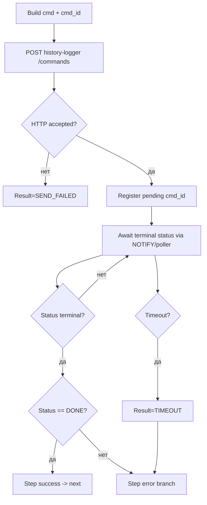
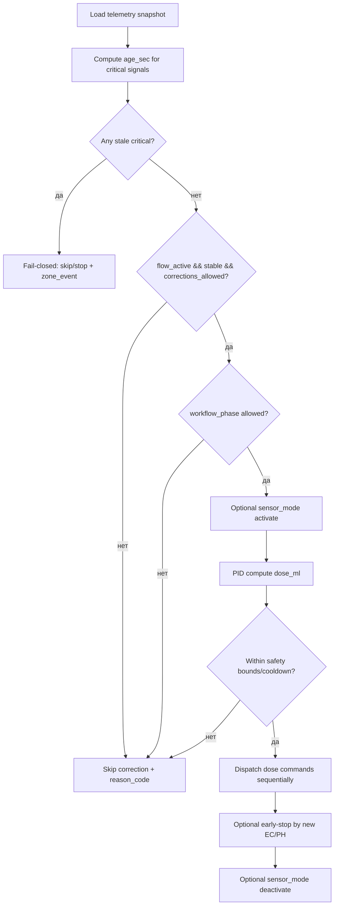
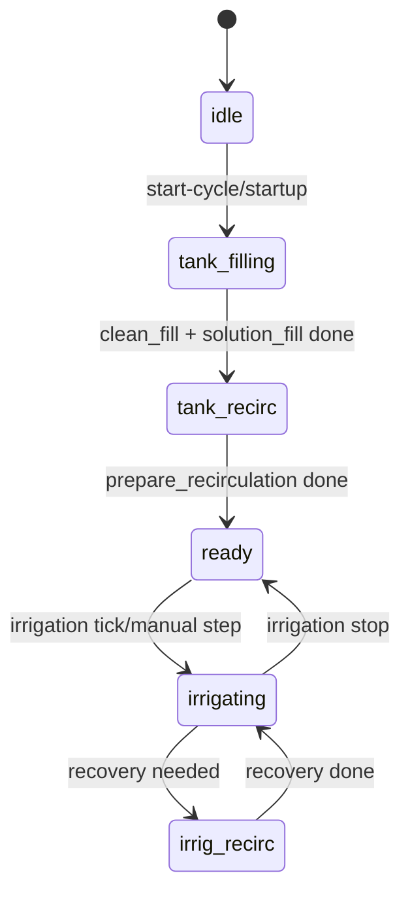

# AE2_LITE_IMPLEMENTATION_PLAN.md
# Полный мастер-план реализации AE2-Lite

**Версия:** 2.0  
**Дата:** 2026-02-21  
**Исполнение:** GPT-5.3 Codex + владелец проекта  
**Статус:** К реализации

Compatible-With: Protocol 2.0, Backend >=3.0, Python >=3.0, Database >=3.0, Frontend >=3.0.
Breaking-change: legacy automation-engine удаляется, обратная совместимость не требуется.

---

## 1. Цель

Полностью пересобрать `automation-engine` в виде `AE2-Lite`:
- простой, читаемый, поддерживаемый solo-разработчиком;
- без legacy-кода и мертвых веток;
- с последовательной моделью выполнения;
- с сохранением командного контракта через `history-logger`.

---

## 2. Scope

Включено:
- `backend/services/automation-engine` (полная замена ядра);
- `backend/services/history-logger` (DB notify для сигналов/статусов);
- `backend/laravel` (scheduler-dispatch, API, миграции, минимальный payload);
- `doc_ai/*` (актуализация архитектурных и контрактных документов);
- Docker e2e smoke.

Не включено (v1):
- любая топология кроме `two_tank`;
- поддержка legacy алиасов/контрактов;
- временное параллельное существование старого AE.

---

## 3. Зафиксированные архитектурные решения

1. Команды к нодам:
- только через `history-logger` `POST /commands`;
- прямой MQTT из AE/Laravel запрещен.

2. Runtime:
- один `event loop`;
- один долгоживущий `ZoneRunner` на зону;
- последовательный `send -> await terminal -> next` (успешный переход шага только при `DONE`).

3. Телеметрия и статусы:
- вариант B: PostgreSQL `LISTEN/NOTIFY` + обязательный fallback polling.

4. Управление:
- режимы только `auto`, `semi`, `manual`.

5. Единственный внешний запуск цикла:
- только `POST /zones/{id}/start-cycle`;
- legacy запуск через `POST /scheduler/task` удаляется.

6. Источник runtime-данных для AE2-Lite:
- прямой SQL read-model (PostgreSQL) для телеметрии/конфига/targets/state;
- без зависимости от Laravel internal effective-targets API в runtime path.

7. Command plans:
- хранятся в отдельной колонке `zone_automation_logic_profiles.command_plans`;
- вводится явный приоритет резолва и обязательная миграция данных из `subsystems`.

8. Scheduler dispatch model:
- Laravel scheduler пишет intent в БД;
- затем вызывает `POST /zones/{id}/start-cycle` (wake-up);
- AE2-Lite сам подхватывает pending intent и выполняет device-level команды через history-logger.

9. Legacy:
- удалять по мере замены;
- финальный cleanup-аудит обязателен.

---

## 4. Ограничения и правила

1. БД:
- только Laravel migrations;
- ручной DDL запрещен.

2. Код:
- файл нового AE2-Lite < 400 строк;
- минимальные абстракции, явная логика;
- no hidden magic.

3. Контракты:
- не ломать общий pipeline `ESP32 -> MQTT -> Python -> PostgreSQL -> Laravel -> Vue`;
- при изменении контракта обновлять спецификации одновременно с кодом.

4. Качество:
- unit + integration обязательны;
- e2e smoke в Docker обязателен.

5. Security baseline:
- для endpoint-ов запуска и ручных действий обязательны token/auth проверки;
- role-ограничения Laravel (`operator/admin/agronomist/engineer`) сохраняются или документированно пересматриваются;
- удаление security-проверок без замещающего механизма запрещено.

---

## 5. Приоритеты

## P0 (release gate)
- ядро AE2-Lite;
- two-tank workflow;
- command gateway через history-logger;
- `LISTEN/NOTIFY + polling`;
- режимы `auto|semi|manual`;
- обязательный legacy cleanup.

## P1
- rich zone state для UI;
- упрощенные pH/EC correction controllers;
- Laravel scheduler cutover на минимальный payload.

## P2
- perf/latency tuning;
- observability улучшения;
- расширенный e2e набор.

---

## 6. Зоны ответственности

## 6.1 AE2 Core (Python)
- новый runtime, zone runners, workflow engine, correction, state API;
- удаление старых entrypoints и модулей.

## 6.2 History-Logger (Python)
- DB triggers/functions для `NOTIFY`;
- сохранение текущего REST/MQTT контракта.

## 6.3 Laravel + Scheduler
- минимальный `POST /zones/{id}/start-cycle` контракт;
- миграции, API адаптеры, проксирование для UI.

## 6.4 Database
- schema изменения под command plans / state / notify;
- индексы и rollback.

## 6.5 Documentation
- фиксация всех изменений в `doc_ai`.

## 6.6 QA
- unit/integration/e2e smoke;
- cleanup-аудит.

## 6.7 SQL Read-Model Contract (обязательный)

AE2-Lite в runtime не запрашивает Laravel effective-targets API.  
Вместо этого используется direct SQL read-model с детерминированным приоритетом:

`phase snapshot -> grow_cycle_overrides -> zone_automation_logic_profiles (active mode)`.

Минимальный набор читаемых сущностей:
- `zones`, `grow_cycles`, `grow_cycle_phases`
- `zone_automation_logic_profiles`
- `nodes`, `node_channels`, `infrastructure_instances`, `channel_bindings`
- `telemetry_last`, `telemetry_samples`
- `zone_workflow_state`, `zone_events`, `commands`

Требование паритета:
- SQL read-model должен воспроизводить текущую каноническую семантику `effective_targets`:
  - `execution`-поля;
  - `enabled -> force_skip`;
  - приоритеты override.

DoD read-model:
- есть спецификация SQL-сборки и mapping таблиц -> runtime DTO;
- integration-тесты паритета SQL-резолва с эталонными expected-targets snapshot;
- отсутствуют runtime HTTP-запросы к `/api/internal/effective-targets/*`.

---

## 7. Целевая структура AE2-Lite

```text
automation-engine/
  ae2lite/
    main.py
    api.py
    api_runtime.py
    api_runtime_zone_routes.py
    api_contracts.py
    api_intents.py
    api_start_cycle.py
    api_scheduler_*.py
    api_recovery*.py
    api_zone_state*.py
    api_health.py
    api_rate_limit.py
    api_payload_parsing.py
    api_task_snapshot.py
    main_runtime.py
    main_runtime_cycle.py
    main_runtime_ops.py
    main_runtime_shared.py
    main_runtime_shutdown.py
    settings.py
    plan_executor.py
    pg_notify_listener.py
    policy_runtime.py
    effective_targets_notify_runtime.py
    repositories.py
    config/limits.yaml
```

Требование:
- каждый файл < 400 строк;
- отказ от монолитных модулей 1k+ строк.
- неиспользуемые compatibility-фасады удаляются в той же итерации cleanup.

---

## 8. Endpoint policy (актуализация и чистка)

Из текущего AE сохранить только необходимые для новой системы:
- `POST /zones/{id}/start-cycle` (новый canonical)
- `GET /zones/{id}/state` (новый canonical)
- `POST /zones/{id}/control-mode`
- `POST /zones/{id}/manual-step`
- `GET /health/live`
- `GET /health/ready`

Под удаление:
- `/test/hook*`
- `manual-resume`
- `POST /scheduler/task`
- `GET /scheduler/task/{task_id}`
- bootstrap/cutover/compat endpoints, не нужные новому runtime
- прочие legacy маршруты без участия в e2e smoke.

Cutover rule:
- переход маршрутов Laravel и AE выполняется в одном этапе;
- временный dual-routing запрещен;
- после cutover старые route handlers физически удаляются.

Маршруты Laravel/UI:
- публичные Laravel endpoints на время cutover синхронизируются в одном PR с frontend;
- после переключения не допускаются “старый UI -> старый AE route” вызовы;
- критерий завершения: `rg` по репозиторию не находит обращений к удаленным AE legacy path.

## 8.0.1 Canonical `start-cycle` contract

Request (минимальный payload):
```json
{
  "source": "laravel_scheduler",
  "idempotency_key": "sch:z12:irrigation:2026-02-21T10:00:00Z"
}
```

Response (accepted wake-up):
```json
{
  "status": "ok",
  "data": {
    "zone_id": 12,
    "accepted": true,
    "runner_state": "active",
    "deduplicated": false,
    "task_id": "intent-505",
    "idempotency_key": "sch:z12:irrigation:2026-02-21T10:00:00Z"
  }
}
```

Response (terminal intent):
```json
{
  "status": "ok",
  "data": {
    "zone_id": 12,
    "accepted": false,
    "runner_state": "terminal",
    "deduplicated": true,
    "task_id": "intent-88",
    "idempotency_key": "sch:z12:irrigation:2026-02-21T10:00:00Z",
    "task_status": "failed",
    "reason": "start_cycle_intent_terminal"
  }
}
```

Правила:
- endpoint не принимает device-level steps/commands;
- фактические действия берутся только из `zone_automation_intents`;
- при повторе `idempotency_key` для active intent возвращается deduplicated accepted без двойного исполнения;
- при повторе `idempotency_key` для terminal intent возвращается `accepted=false` + `runner_state=terminal` + `task_status`;
- stale `claimed` intent допускается к re-claim после таймаута `AE_START_CYCLE_CLAIM_STALE_SEC`.

## 8.1 Scheduler intents contract (обязательный)

Scheduler не отправляет device-команды в AE.  
Scheduler пишет intent и будит зону через `start-cycle`.

Wake-up only payload policy:
- `zone_automation_intents.payload` содержит только metadata wake-up;
- `task_payload` и `schedule_payload` запрещены;
- task-level runtime payload для исполнения формируется внутри AE2-Lite по canonical правилам (`diagnostics` + `cycle_start`).

Рекомендуемая таблица:
- `zone_automation_intents`
  - `id`
  - `zone_id`
  - `intent_type` (`IRRIGATE_ONCE`, `FORCE_RECOVERY`, ...)
  - `payload` JSONB
  - `idempotency_key`
  - `status` (`pending|claimed|running|completed|failed|cancelled`)
  - `not_before`
  - `claimed_at`, `completed_at`
  - `error_code`, `error_message`
  - `created_at`, `updated_at`

Поток:
1. Laravel scheduler insert `pending intent`.
2. Laravel scheduler -> `POST /zones/{id}/start-cycle`.
3. AE2-Lite claim intent (row lock / SKIP LOCKED), исполняет workflow.
4. AE2-Lite обновляет intent status и пишет `zone_events`.

DoD:
- есть интеграционный тест идемпотентности (`idempotency_key`);
- есть тест конкурентного claim без двойного выполнения;
- есть retry политика для `failed` intents.

---

## 9. Вариант B: Telemetry и command feedback

## 9.1 NOTIFY channels

1. `ae_command_status`
- источник: `commands` insert/update;
- payload: `cmd_id`, `zone_id`, `status`, `updated_at`.

2. `ae_signal_update`
- источники: `telemetry_last`, `zone_events`;
- payload: `zone_id`, `kind`, `updated_at`.

## 9.2 Reconcile polling (обязателен)

- pending commands: 250-500ms;
- active zones signals: 2s;
- passive zones: 10s;
- startup full sync.

## 9.2.1 Анти-шторм и backpressure (обязателен)

- payload NOTIFY минимальный (без больших JSON blobs);
- debounce агрегация по `zone_id` в listener (окно 100-250ms);
- bounded queue для event loop + drop/merge policy для повторов одного ключа;
- hard fallback на polling при перегрузке listener;
- метрики: dropped_notify_count, notify_lag_ms, reconcile_catchup_count.

SLO/Safety thresholds:
- p95 `notify_lag_ms` <= 1000 ms;
- p99 `notify_lag_ms` <= 3000 ms;
- допустимый drop-rate notify событий <= 0.5% (при обязательном reconcile catch-up);
- при `notify_lag_ms > 5000` более 60 сек подряд -> автоматический degraded mode (polling-first).

## 9.3 Freshness guard

`effective_ts = COALESCE(last_ts, updated_at)`  
`age_sec = now - effective_ts`

Пороги:
- pH/EC <= 300s
- flow/stable/corrections_allowed <= 60s
- irr_state <= 30s
- level switches <= 120s

Fail-closed:
- stale critical -> stop/skip + `zone_events` с reason_code.

## 9.4 Командный wait-контракт (обязателен)

Terminal statuses:
- `DONE`
- `ERROR`
- `INVALID`
- `BUSY`
- `NO_EFFECT`
- `TIMEOUT`
- `SEND_FAILED`

Non-terminal statuses:
- `QUEUED`
- `SENT`
- `ACK`

Правило:
- `send_and_wait` завершает await только по terminal-статусам;
- для non-terminal продолжается ожидание до timeout;
- timeout await трактуется как failure и логируется в `command_audit`.
- переход `next` разрешен только при `DONE`; остальные terminal-статусы переводят шаг в error-ветку.

---

## 10. DB migration plan

1. `zone_automation_logic_profiles`:
- `command_plans JSONB NOT NULL DEFAULT '{}'::jsonb`.
- структура `command_plans` включает `schema_version` и `plan_version`;
- каждый plan содержит `steps[]` с обязательными полями (`channel`, `cmd`, `params`).
- приоритет резолва: `command_plans` -> fallback `subsystems.diagnostics.execution.two_tank_commands` (только на период миграции);
- после завершения миграции fallback удаляется.

2. `zone_automation_state`:
- canonical runtime snapshot (JSONB state);
- optional `state_version`, `last_event_id`.

3. `command_audit`:
- `cmd_id`, `status`, `sent_at`, `done_at`, `latency_ms`.

4. Triggers/functions:
- `commands` -> `NOTIFY ae_command_status`;
- `telemetry_last` -> `NOTIFY ae_signal_update`;
- `zone_events` -> `NOTIFY ae_signal_update`.

4.1 Совместимость с partitioned/hypertable:
- явно проверить поведение триггеров на `commands` и `zone_events` после партиционирования;
- для новых партиций триггеры должны применяться автоматически (или через attach-step миграции);
- добавить smoke-проверку: событие из новой месячной партиции действительно уходит в `NOTIFY`.

5. Индексы:
- `commands(cmd_id)`, `commands(status, updated_at)`;
- `zone_events(zone_id, created_at, type)`;
- `telemetry_last(sensor_id, updated_at)`.

6. Миграция данных `command_plans` (обязательна):
- backfill из активных профилей `subsystems` в новую колонку;
- валидация схемы каждого плана;
- отчет по зонам с неполными/битым планами;
- блокирующее правило cutover: нет зон с пустым/invalid `command_plans`.
- если `schema_version` отсутствует/неподдерживаем -> профиль помечается invalid, rollout блокируется.

---

## 11. Файл лимитов и флагов

Создать:
- `backend/services/automation-engine/ae2lite/config/limits.yaml`

Содержимое:
- workflow timeouts;
- polling/notifier intervals;
- freshness thresholds;
- correction safety bounds;
- PID limits;
- feature flags;
- комментарий к каждому параметру.

Требования:
- все runtime-лимиты и флаги вынесены сюда;
- код не содержит “магических” чисел.

---

## 12. План этапов с жестким DoD

## Stage 0: Legacy inventory + target map
Сделать:
- список keep/delete по файлам, endpoint-ам, env флагам.

DoD:
- `legacy_inventory.md` создан;
- все entrypoints классифицированы;
- freeze на новые фичи в старом AE.

## Stage 1: AE2-Lite skeleton
Сделать:
- базовый пакет `ae2lite/*`;
- минимальный API + startup.

DoD:
- сервис поднимается в Docker;
- health/live и health/ready зелёные;
- security smoke: неавторизованный вызов `start-cycle` получает 401/403;
- file-size правило соблюдено.

## Stage 2: Command gateway + state wait
Сделать:
- `send -> await terminal status`;
- pending map + timeout + audit.

DoD:
- integration test: успешная команда и timeout;
- integration test: `ACK/SENT/QUEUED` не завершают await;
- integration test: каждый terminal-статус завершает await корректно;
- command audit пишется корректно.

## Stage 3: LISTEN/NOTIFY + polling
Сделать:
- миграции trigger/function;
- listener + reconcile poller.

DoD:
- события приходят через notify;
- при потере notify polling догоняет без потерь;
- при burst нагрузке включается debounce/backpressure без деградации core loop;
- проверено, что notify работает на новых партициях `commands/zone_events` (и при Timescale hypertable режиме);
- тесты notify/fallback зелёные.

## Stage 4: Two-tank workflow
Сделать:
- startup/check/recovery;
- command plans из БД;
- expected-vs-actual guards.

DoD:
- happy-path проходит;
- critical fail-closed покрыт тестами;
- legacy two-tank ветки удалены.

## Stage 5: Correction controllers
Сделать:
- новый pH/EC correction;
- unified gating/freshness;
- sensor mode orchestration.

DoD:
- unit по PID/gating/freshness;
- integration по pH/EC correction;
- safety bounds и cooldown работают.

## Stage 6: Laravel scheduler cutover
Сделать:
- минимальный payload start-cycle;
- убрать legacy scheduler contract (`/scheduler/task` path).

DoD:
- scheduler запускает цикл только через `POST /zones/{id}/start-cycle`;
- e2e smoke зелёный;
- security regression tests зелёные (token validation, role matrix, idempotency replay);
- legacy scheduler endpoint logic удалена физически (AE + Laravel adapters).

## Stage 7: Final cleanup audit
Сделать:
- удалить весь неиспользуемый код;
- обновить документацию;
- финальная проверка тестов.

DoD:
- `legacy_cleanup_audit.md` создан;
- runtime не зависит от legacy модулей;
- unit + integration + e2e smoke зелёные.

---

## 13. Правило удаления legacy (обязательное)

1. Заменил участок -> в той же задаче удалил legacy-реализацию.
2. Нельзя оставлять dead code “на потом”.
3. Неиспользуемые:
- endpoints;
- тесты;
- env флаги;
- helper модули
удаляются сразу.

Уточнение по тестам:
- legacy тест удаляется только при наличии замещающего теста на новую ветку поведения;
- снижение тестового покрытия относительно Stage baseline запрещено.

Критерий принятия задачи:
- есть список удаленного legacy;
- нет новых ссылок на старые модули.

---

## 14. Тестовый baseline

1. Unit:
- workflow transitions;
- plan executor;
- pid/gating/freshness;
- control-mode/manual-step.

2. Integration:
- AE2-Lite + history-logger commands;
- notify/polling;
- state persistence/recovery.

3. E2E smoke (Docker):
- `start-cycle -> two-tank progression -> state API`;
- stale/fail-closed сценарий;
- manual-step в `semi/manual`.

4. Security/abuse:
- 401/403 для вызовов без токена/роли;
- replay test по `idempotency_key`;
- запрет manual-step в `auto`;
- rate-limit smoke для burst вызовов `start-cycle`.

---

## 15. Checklist обновления документации

Обновить при релевантных изменениях:
- `doc_ai/04_BACKEND_CORE/PYTHON_SERVICES_ARCH.md`
- `doc_ai/04_BACKEND_CORE/HISTORY_LOGGER_API.md`
- `doc_ai/04_BACKEND_CORE/TWO_TANK_RUNTIME_LOGIC_CURRENT.md`
- `doc_ai/05_DATA_AND_STORAGE/DATA_MODEL_REFERENCE.md`
- `doc_ai/06_DOMAIN_ZONES_RECIPES/CORRECTION_CYCLE_SPEC.md`
- `doc_ai/06_DOMAIN_ZONES_RECIPES/EFFECTIVE_TARGETS_SPEC.md`
- `doc_ai/03_TRANSPORT_MQTT/*` (если затронуты транспортные контракты).

Дополнительно:
- явно зафиксировать переход к direct SQL read-model для AE2-Lite runtime;
- явно зафиксировать удаление `POST /scheduler/task` из публичного runtime-контракта.
- задокументировать контракт таблицы scheduler intents и lifecycle статусов.
- задокументировать JSON-схему `command_plans` (`schema_version`, `plan_version`, `steps`).

## 15.1 Canonical docs (must be consistent)

- `doc_ai/04_BACKEND_CORE/PYTHON_SERVICES_ARCH.md`
- `doc_ai/04_BACKEND_CORE/REST_API_REFERENCE.md`
- `doc_ai/04_BACKEND_CORE/API_SPEC_FRONTEND_BACKEND_FULL.md`
- `doc_ai/03_TRANSPORT_MQTT/MQTT_SPEC_FULL.md`
- `doc_ai/05_DATA_AND_STORAGE/DATA_MODEL_REFERENCE.md`
- `doc_ai/01_SYSTEM/LOGIC_ARCH.md`
- `backend/services/AGENTS.md`

Правило:
- если legacy-документ нельзя переписать в текущем этапе, он помечается `LEGACY / SUPERSEDED`
  с явной ссылкой на этот план как на каноничный источник.

---

## 16. Task card template для GPT-5.3 Codex

```md
Role: AE2-Lite implementation engineer.
Goal: <what to deliver>.
Scope: <files/modules>.
Constraints:
- commands only via history-logger
- no direct MQTT in AE/Laravel
- files < 400 LOC
- remove replaced legacy immediately
DoD:
1. ...
2. ...
3. ...
Tests:
- unit: ...
- integration: ...
- e2e smoke impact: yes/no
Artifacts:
- changed files
- deleted legacy files
- docs updated
```

---

## 17. English block for Commit / PR

### Commit
```text
feat(ae2-lite): <summary>

- implement: <new behavior>
- cleanup: <legacy removed>
- tests: <unit/integration/e2e smoke>
- docs: <updated files>
```

### PR
```text
## Summary
Implement AE2-Lite stage <N> with strict sequential workflow.

## Breaking Changes
Legacy automation-engine paths removed intentionally.

## Compatibility
Compatible-With: Protocol 2.0, Backend >=3.0, Python >=3.0, Database >=3.0, Frontend >=3.0.

## Scope
- automation-engine:
- history-logger:
- laravel scheduler:
- database migrations:
- docs:

## Legacy Cleanup
- deleted files:
- deleted endpoints:
- deleted flags:

## Validation
- unit:
- integration:
- e2e smoke:
```

---

## 18. Блок-схемы алгоритмов (AE2-Lite)

### 18.1 End-to-End запуск цикла (`start-cycle` + intents)

```mermaid
flowchart TD
    A[Laravel scheduler] --> B[INSERT zone_automation_intents status=pending]
    B --> C[POST /zones/{id}/start-cycle]
    C --> D{Auth/role/idempotency OK?}
    D -- нет --> E[401/403/409]
    D -- да --> F[ZoneRegistry.ensure_runner zone_id]
    F --> G[Wake ZoneRunner]
    G --> H[ZoneRunner claim intent FOR UPDATE SKIP LOCKED]
    H --> I{Intent найден?}
    I -- нет --> J[NOOP: state unchanged]
    I -- да --> K[Intent status=claimed/running]
    K --> L[Execute workflow steps]
    L --> M{Успех?}
    M -- да --> N[Intent status=completed]
    M -- нет --> O[Intent status=failed + error_code]
    N --> P[Update zone_state + zone_events]
    O --> P
```

### 18.2 Долгоживущий `ZoneRunner` (один корутин на зону)

```mermaid
flowchart TD
    A[ZoneRunner loop] --> B[Load read-model snapshot]
    B --> C[Sync mode auto|semi|manual]
    C --> D{Есть active intent/phase?}
    D -- нет --> E[Sleep short interval]
    E --> A
    D -- да --> F[TwoTankWorkflow step executor]
    F --> G{Phase in ready|irrigating?}
    G -- нет --> H[Persist state + events]
    H --> A
    G -- да --> I{Mode = auto/semi?}
    I -- нет --> H
    I -- да --> J[Run CorrectionLoop pH/EC]
    J --> H
```

### 18.3 `send_and_wait`: последовательное выполнение команд



Terminal statuses:
- `DONE|ERROR|INVALID|BUSY|NO_EFFECT|TIMEOUT|SEND_FAILED`

Non-terminal statuses:
- `QUEUED|SENT|ACK`

### 18.4 Freshness + Gating для pH/EC коррекции



### 18.5 Two-tank workflow: high-level state machine



### 18.6 Обновление UI state (rich `ZoneState`)

```mermaid
flowchart TD
    A[Workflow/Cmd event] --> B[Mutate in-memory ZoneState]
    B --> C[Persist zone_automation_state]
    C --> D[Append zone_events]
    D --> E[GET /zones/{id}/state returns full snapshot]
```
